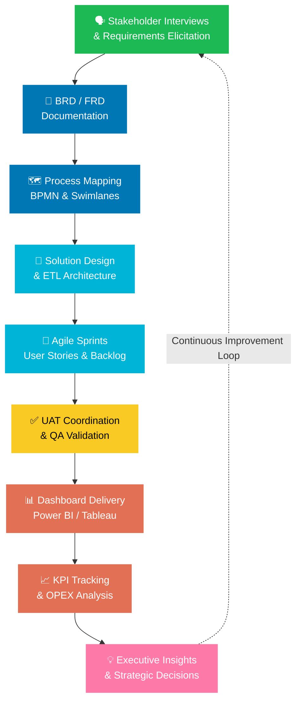

<div align="center">


<br/>

<a href="https://www.linkedin.com/in/ishtarth-umesh-497582170/">
  
</a>
<a href="mailto:ishtarthumesh06@gmail.com">
  
</a>


<br/><br/>


</div>

---

## 💼 &nbsp; Why Hire Me — The 30-Second Pitch

<table>
<tr>
<td width="65%">

> **I am a Big 4-trained Business Analyst** who bridges the gap between messy data and executive decisions. At KPMG, I didn't just build pipelines — I **identified $1M+ in cost savings**, earned two performance awards, and led cross-functional Agile teams across Finance, Operations, and Audit domains.
>
> I speak two languages fluently: **SQL and C-Suite.** I translate complex data architectures into business narratives that drive action — and I back every recommendation with numbers.
>
> Now pursuing a Master's in Engineering Management at **Tufts University**, I'm combining technical depth with strategic business thinking to take on roles that demand both.

</td>
<td width="35%" align="center">

```
┌─────────────────────────┐
│   QUICK STATS           │
├─────────────────────────┤
│ 🏢 Big 4: KPMG          │
│ ⏱️  3 Years Experience   │
│ 💰 $1M+ Cost Impact      │
│ 🏅 2x Award Winner      │
│ 📊 5+ Dashboards Built  │
│ 👥 20+ Leaders Served   │
│ 🎓 Tufts MEM (2027)     │
│ ✈️  Aerospace → Analytics│
└─────────────────────────┘
```

</td>
</tr>
</table>

---

## 🎯 &nbsp; Core Competencies — What I Bring on Day 1

<div align="center">

| 🧠 Business Analysis | 📐 Process & Delivery | 📊 Data & BI | 🤝 Stakeholder Mgmt |
|:---|:---|:---|:---|
| Requirements Elicitation | Agile / Scrum | SQL & PySpark | C-Suite Reporting |
| BRD / FRD Documentation | Sprint Planning | Power BI / Tableau | Cross-Functional Leadership |
| User Stories & Use Cases | Backlog Grooming | Python Automation | Change Management |
| Gap Analysis | UAT Coordination | ETL Pipelines | Stakeholder Mapping |
| SWOT / Cost-Benefit Analysis | SDLC (Agile + Waterfall) | Azure Data Services | Executive Presentations |
| Process Mapping (BPMN) | RACI Matrix | Data Modeling | Workshop Facilitation |
| Root Cause Analysis | Release Management | Statistical Analysis | Conflict Resolution |
| KPI Design & Tracking | Risk Assessment | Forecasting Models | Vendor Management |

</div>

---

## 🏆 &nbsp; Proven Business Impact — Numbers That Matter

<div align="center">


</div>

```
  ┌──────────────┐    ┌──────────────┐    ┌──────────────┐    ┌──────────────┐
  │   $1M+       │    │    99%       │    │    90%       │    │    30%       │
  │  Cost        │    │   Audit      │    │   Error      │    │   Faster     │
  │  Savings     │    │  Accuracy    │    │  Reduction   │    │    ETL       │
  │  Identified  │    │  Achieved    │    │  Delivered   │    │  Processing  │
  └──────────────┘    └──────────────┘    └──────────────┘    └──────────────┘
         │                   │                   │                   │
    ETL & Process       5 Departments       Data Validation      🏅 Award
    Optimization        Governed            Automation           Winning

  ┌──────────────┐    ┌──────────────┐    ┌──────────────┐    ┌──────────────┐
  │   15%        │    │    20%       │    │    24hrs     │    │     8%       │
  │   Audit      │    │  Stakeholder │    │   Business   │    │ Operational  │
  │   Time       │    │ Satisfaction │    │   Insight    │    │ Efficiency   │
  │  Reduction   │    │  Increase    │    │  Expedited   │    │  Increase    │
  └──────────────┘    └──────────────┘    └──────────────┘    └──────────────┘
         │                   │                   │                   │
    UAT Automation      Change Mgmt         Streamlined          Avg across
    & Data Reliability  & Reliability        ETL Pipelines      20+ Leaders
```

---

## 🛠️ &nbsp; Full Tech & Methodology Arsenal

<div align="center">

### 💻 &nbsp; Languages & Querying


### 📊 &nbsp; BI, Visualization & Reporting


### ☁️ &nbsp; Cloud, Data Platforms & ERP


### 🔄 &nbsp; Project & Collaboration Tools


### 📐 &nbsp; BA Methodologies & Frameworks


</div>

---

## 🔁 &nbsp; The BA Lifecycle — How I Deliver Results



---

## 💼 &nbsp; Experience Snapshot

### 🏢 KPMG Global Delivery Center — Business Analyst &nbsp;|&nbsp; Aug 2022 – Jul 2025

<details>
<summary><b>🔍 Click to expand full impact details</b></summary>

<br/>

| Domain | What I Did | Business Outcome |
|:---|:---|:---|
| **Cost Optimization** | Led Agile cross-functional data pipeline design | **$1M+** cost savings identified |
| **Data Governance** | Spearheaded pipeline architecture across 5 departments | **99%** audit accuracy maintained |
| **Process Automation** | Built automated UAT validation workflows | **15%** reduction in audit time |
| **Data Quality** | End-to-end data validation frameworks | **90%** drop in data discrepancies |
| **Stakeholder Relations** | Optimized ETL workflows & change management | **20%** increase in satisfaction |
| **Insight Delivery** | Streamlined enterprise data management system | Business insights **24 hours faster** |
| **Executive Dashboards** | 5+ interactive dashboards with SQL & PySpark | **20+ leaders** with real-time KPIs |
| **ETL Optimization** | Reduced processing time end-to-end | **30% faster** — 🏅 Award Winning |
| **Automation** | Python-based data validation pipeline | Accuracy improvement across reports |

**🏅 Client Service Excellence Award** — ETL processing time reduced by 30%  
**⭐ Rising Star Award** — Pioneering automated Python data validation

</details>

---

## 📂 &nbsp; Key Deliverables I've Shipped

<div align="center">

```
 📄 Business Requirements Documents (BRDs)     ✅ Delivered
 📄 Functional Requirements Documents (FRDs)   ✅ Delivered
 🗺️  Process Maps & BPMN Swimlane Diagrams      ✅ Delivered
 📊 5+ Executive Power BI / Tableau Dashboards  ✅ Delivered
 🔧 Enterprise Data Management System          ✅ Delivered
 🤖 Automated Python Data Validation Engine    ✅ Delivered
 📐 RACI Matrices & Stakeholder Maps           ✅ Delivered
 🧪 UAT Test Plans & Sign-off Documentation    ✅ Delivered
 📈 KPI Frameworks & OPEX Reporting            ✅ Delivered
 🔄 ETL Pipeline Architecture Docs             ✅ Delivered
```

</div>

---

## 📊 &nbsp; Domain Expertise

<div align="center">

```
Financial Services  ████████████████████  ██  Expert (KPMG Big 4)
Enterprise Data     ████████████████████  ██  Expert
Audit & Compliance  ██████████████████    ░░  Advanced
Operations Mgmt     ████████████████      ░░  Advanced
Product Analytics   ██████████████        ░░  Proficient
Financial Modeling  ████████████          ░░  Proficient
Customer Research   ████████████          ░░  Proficient
```

</div>

---

## 🎓 &nbsp; Education & Credentials

<div align="center">

```
╔══════════════════════════════════════════════════════════════════════════════╗
║                                                                              ║
║  🎓  Master in Engineering Management — Tufts University, Boston MA          ║
║      Sep 2025 – May 2027  |  GPA: In Progress                               ║
║      ▸ Technology Strategy   ▸ Building Financial Intelligence               ║
║      ▸ Customer Discovery    ▸ Program & Project Management                  ║
║      ▸ Introduction to Data Analytics                                        ║
║                                                                              ║
╠══════════════════════════════════════════════════════════════════════════════╣
║                                                                              ║
║  🎓  B.E. Aerospace Engineering — BMS College of Engineering, Bengaluru      ║
║      Aug 2018 – Jun 2022                                                     ║
║      ▸ Engineering problem-solving mindset applied to business analytics     ║
║                                                                              ║
╚══════════════════════════════════════════════════════════════════════════════╝
```

</div>

---

## 🏅 &nbsp; Certifications

<div align="center">

| Certification | Issuer | Focus |
|:---|:---|:---|
| 🎓 **Product Analytics Certification** | Industry | Funnel analysis, retention, product KPIs |
| 🎓 **Microsoft AI Solutions in Azure** | Microsoft | AI/ML on Azure cloud platform |
| 🎓 **Power BI Data Analyst Associate** | Microsoft | Enterprise BI & DAX reporting |
| 🎓 **Azure Data Fundamentals (DP-900)** | Microsoft | Cloud data storage & processing |

</div>

---

## 🌟 &nbsp; What Makes Me Different

<div align="center">

| 🔴 Most BA Candidates... | 🟢 I... |
|:---|:---|
| List tools they know | Show **business outcomes** those tools created |
| Come from pure tech backgrounds | Bridge **tech and business** fluently |
| Work in one methodology | Have shipped in **Agile AND Waterfall SDLC** |
| Report to stakeholders | **Influence** stakeholders at the C-suite level |
| Build reports | Build **decision-enabling insights** |
| Have one domain | Span **Finance, Ops, Audit, and Product** |
| Just analyze | **Lead** cross-functional initiatives end-to-end |

</div>

---

## 🚀 &nbsp; Current Projects

```yaml
Project 1:
  Name: "Pro Forma Financial Reporting"
  Status: 🟡 In Progress (Sep 2025 – Present)
  Doing: Modeling financial statements to project company performance
  Skills: Financial Modeling · Scenario Analysis · Excel · Decision Support

Project 2:
  Name: "FreshStart Food Insights"
  Status: 🟡 In Progress (Sep 2025 – Present)
  Doing: Customer discovery for 80%+ of food challenges among newcomers
  Target: Inform solutions to improve food adaptation outcomes by 70%+
  Skills: Customer Discovery · Research Design · Insight Generation · UX Research
```

---

## 📈 &nbsp; GitHub Activity

<div align="center">


</div>

<div align="center">

</div>

---

<div align="center">

## 📬 &nbsp; Ready to Talk?

### *I turn your messiest data problems into your clearest competitive advantages.*

<br/>

> **"The best business analysts don't just answer questions — they ask better ones."**

<br/>

[](https://www.linkedin.com/in/ishtarth-umesh-497582170/)
&nbsp;&nbsp;
[](mailto:ishtarthumesh06@gmail.com)
&nbsp;&nbsp;
[](https://www.linkedin.com/in/ishtarth-umesh-497582170/)

<br/>


</div>
