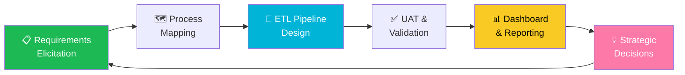

<div align="center">

<!-- Animated Header Banner -->


<!-- Typing SVG -->


<br/>

<!-- Profile Visitor Counter -->

&nbsp;

&nbsp;


<br/><br/>

<!-- Social Badges -->
[](https://www.linkedin.com/in/ishtarth-umesh-497582170/)
[](mailto:ishtarthumesh06@gmail.com)

</div>

---


## 👤 &nbsp; Who Am I?

```yaml
Name        : Ishtarth Umesh
Role        : Business Analyst & Data Engineer
Experience  : 3 Years @ KPMG Global Delivery Center
Education   : MEM @ Tufts University (2025–2027)
              B.E. Aerospace Engineering
Location    : Boston, MA 🇺🇸 (Originally Bengaluru 🇮🇳)
Focus       : Data Pipelines | BI | Agile BA | ETL
Superpower  : Translating complexity → clarity
```

🔭 **Currently building:** Financial Models & FreshStart Food Insights Research  
🤝 **Open to collaborate on:** Data Analytics, ETL, BI Dashboards, Product Analytics  
🌱 **Learning:** Technology Strategy, Advanced Data Analytics, Financial Intelligence  
💬 **Ask me about:** SQL, Power BI, Azure, Agile BA, ETL Pipelines  
⚡ **Fun fact:** Aerospace Engineer → caught data fever → never looked back ✈️📊

<br clear="right"/>

---

## 🏆 &nbsp; Impact at a Glance

<div align="center">

<table>
<tr>
<td align="center" width="220">
<br/>
<sub>via ETL & process optimization at KPMG</sub>
</td>
<td align="center" width="220">
<br/>
<sub>across 5+ key operational departments</sub>
</td>
<td align="center" width="220">
<br/>
<sub>in data-related discrepancies</sub>
</td>
</tr>
<tr>
<td align="center">
<br/>
<sub>Client Service Excellence Award 🏅</sub>
</td>
<td align="center">
<br/>
<sub>expedited via streamlined pipelines</sub>
</td>
<td align="center">
<br/>
<sub>via 5+ real-time executive dashboards</sub>
</td>
</tr>
</table>

</div>

---

## 🛠️ &nbsp; Tech Stack & Tools

<div align="center">

### 🔢 Languages & Analytics


### 📊 BI & Visualization


### ☁️ Cloud & Platforms


### 🔄 Practices & Methodologies


</div>

---

## 🎯 &nbsp; The BA Lifecycle — How I Work



---

## 📂 &nbsp; Featured Projects

<div align="center">

| 🚀 Project | 🛠️ Tools | 💥 Impact |
|:---|:---|:---|
| **Enterprise Data Management System** | SQL · PySpark · Azure | Expedited insights delivery by **24 hours** across org |
| **Automated Data Validation Engine** | Python · ETL | **90%** discrepancy reduction, **15%** faster audits |
| **Executive BI Dashboards (5+)** | Tableau · Power BI · SQL | Empowered **20+ leaders** with real-time KPIs → +8% efficiency |
| **Pro Forma Financial Reporting** | Excel · Financial Modeling | Decision-support for investment scenarios |
| **FreshStart Food Insights** | Customer Discovery · Research | Identified **80%+ food challenges** for newcomers |

</div>

---

## 📈 &nbsp; GitHub Stats

<div align="center">


</div>

<div align="center">

</div>

---

## 🏅 &nbsp; Certifications

<div align="center">

[](https://www.linkedin.com/in/ishtarth-umesh-497582170/)
[](https://www.linkedin.com/in/ishtarth-umesh-497582170/)
[](https://www.linkedin.com/in/ishtarth-umesh-497582170/)
[](https://www.linkedin.com/in/ishtarth-umesh-497582170/)

</div>

---

## 🎓 &nbsp; Education

<div align="center">

```
╔══════════════════════════════════════════════════════════════════════╗
║  🎓 Master in Engineering Management                                 ║
║     Tufts University · Boston, MA · Sep 2025 – May 2027             ║
║     Technology Strategy · Financial Intelligence · Data Analytics    ║
╠══════════════════════════════════════════════════════════════════════╣
║  🎓 B.E. Aerospace Engineering                                       ║
║     BMS College of Engineering · Bengaluru, India · 2018 – 2022     ║
╚══════════════════════════════════════════════════════════════════════╝
```

</div>

---

## 🌊 &nbsp; Contribution Activity

<div align="center">

</div>

---

<div align="center">

### 🤝 &nbsp; Let's Build Something with Data

*"Data is the new oil — but refined data is the jet fuel for better decisions."*

<br/>

[](https://www.linkedin.com/in/ishtarth-umesh-497582170/)
&nbsp;
[](mailto:ishtarthumesh06@gmail.com)

<br/>


</div>
