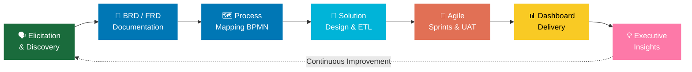

<div align="center">

<!-- ✅ RELIABLE HEADER — uses svg instead of capsule-render -->


<!-- ✅ RELIABLE TYPING SVG — demolab is stable -->
[](https://git.io/typing-svg)

<br/>

<!-- ✅ BADGES — shields.io is the most reliable service -->
[](https://www.linkedin.com/in/ishtarth-umesh-497582170/)
[](mailto:ishtarthumesh06@gmail.com)
[](https://www.linkedin.com/in/ishtarth-umesh-497582170/)
[](mailto:ishtarthumesh06@gmail.com)

<br/>

<!-- ✅ PROFILE VIEWS — correct username -->


</div>

<br/>

---

## 💼 &nbsp; The 30-Second Pitch

<table>
<tr>
<td width="60%">

> 🏢 **Big 4-trained Business Analyst** with 3 years at KPMG — I bridge the gap between raw data and executive decisions that actually move the needle.
>
> I speak two languages fluently: **SQL and C-Suite.** I've identified **$1M+ in cost savings**, won **two performance awards**, and led Agile cross-functional teams across Finance, Audit, and Operations.
>
> Currently leveling up with a **Master's in Engineering Management at Tufts University**, combining deep technical skills with strategic business thinking.

**📞 339-242-8713 &nbsp;|&nbsp; 📧 ishtarthumesh06@gmail.com &nbsp;|&nbsp; 📍 Boston, MA**

</td>
<td width="40%" align="center">

```yaml
Name     : Ishtarth Umesh
Company  : KPMG Global Delivery Center
Title    : Business Analyst
Duration : 3 Years (Aug 2022–Jul 2025)
Impact   : $1M+ Cost Savings
Awards   : 2x Performance Awards
Education: MEM @ Tufts University
Location : Boston, MA 🇺🇸
```

</td>
</tr>
</table>

---

## 🏆 &nbsp; Quantified Business Impact

<div align="center">

|  | Metric | Result | Context |
|:---:|:---|:---:|:---|
| 💰 | Cost Savings Identified | **$1M+** | ETL & process optimization at KPMG |
| ✅ | Audit Accuracy Achieved | **99%** | Across 5+ operational departments |
| 📉 | Data Error Reduction | **90%** | Automated validation frameworks |
| ⚡ | ETL Processing Speed | **30% faster** | 🏅 Client Service Excellence Award |
| ⏱️ | Audit Time Saved | **15%** | UAT automation & pipeline design |
| 😊 | Stakeholder Satisfaction | **+20%** | Finance & Operations teams |
| 📊 | Insight Delivery | **24 hrs faster** | Streamlined data management system |
| 📈 | Operational Efficiency | **+8% avg** | Across 20+ business leaders |

</div>

---

## 🎯 &nbsp; Core BA Competencies — What I Bring on Day 1

<div align="center">

| 🧠 Business Analysis | 📐 Process & Delivery | 📊 Data & BI | 🤝 Stakeholder Management |
|:---|:---|:---|:---|
| Requirements Elicitation | Agile / Scrum | SQL & PySpark | C-Suite Reporting |
| BRD / FRD Writing | Sprint Planning & Backlog | Power BI / Tableau | Cross-Functional Leadership |
| User Stories & Use Cases | UAT Coordination | Python Automation | Change Management |
| Gap & Impact Analysis | SDLC (Agile + Waterfall) | ETL Pipeline Design | Stakeholder Mapping |
| SWOT / Cost-Benefit Analysis | RACI Matrix Design | Azure Data Services | Executive Presentations |
| Process Mapping (BPMN) | Release Management | Data Modeling & Governance | Workshop Facilitation |
| Root Cause Analysis | Risk Assessment | Statistical Analysis & A/B | Vendor Management |
| KPI Design & Tracking | Data Quality Management | Forecasting & OPEX Analysis | Conflict Resolution |

</div>

---

## 🛠️ &nbsp; Full Tech Stack

<div align="center">

**🔢 Languages & Querying**


**📊 BI, Visualization & Reporting**


**☁️ Cloud, Platforms & ERP**


**🔄 Project & Collaboration Tools**


**📐 Methodologies & Frameworks**


</div>

---

## 🔁 &nbsp; The BA Lifecycle — How I Deliver Results



---

## 💼 &nbsp; Experience — KPMG Global Delivery Center

<details open>
<summary><b>🔍 Business Analyst | Aug 2022 – Jul 2025 | Bengaluru, India</b></summary>

<br/>

| Domain | What I Did | Outcome |
|:---|:---|:---|
| **Cost Optimization** | Led Agile data pipeline design across cross-functional teams | **$1M+** savings identified |
| **Data Governance** | Implemented pipeline architectures across 5 departments | **99%** audit accuracy |
| **Process Automation** | Built automated UAT & validation workflows end-to-end | **15%** audit time reduction |
| **Data Quality** | End-to-end data validation & discrepancy frameworks | **90%** error reduction |
| **Stakeholder Relations** | ETL optimization + change management programs | **+20%** satisfaction score |
| **Insight Delivery** | Developed Enterprise Data Management System | Insights **24 hrs faster** |
| **Executive Dashboards** | 5+ SQL + PySpark dashboards for senior leadership | **20+ leaders** empowered |
| **ETL Optimization** | End-to-end processing time reduction | **30% faster** ← 🏅 Award |
| **Automation (Python)** | Automated data validation pipeline from scratch | Report accuracy significantly improved |

<br/>

> 🏅 **Client Service Excellence Award** — Reduced ETL processing time by 30%  
> ⭐ **Rising Star Award** — Pioneered Python automated data validation

</details>

---

## 📦 &nbsp; Key BA Artifacts I've Delivered

```
 ✅  Business Requirements Documents (BRDs)
 ✅  Functional Requirements Documents (FRDs)
 ✅  Process Maps & BPMN Swimlane Diagrams
 ✅  5+ Executive Power BI / Tableau Dashboards
 ✅  Enterprise Data Management System
 ✅  Automated Python Data Validation Engine
 ✅  RACI Matrices & Stakeholder Maps
 ✅  UAT Test Plans & Sign-off Documentation
 ✅  KPI Frameworks & OPEX Reporting Templates
 ✅  ETL Pipeline Architecture Documentation
```

---

## 🌟 &nbsp; What Makes Me Different

| 🔴 Most BA Candidates... | 🟢 I Deliver... |
|:---|:---|
| List tools they know | **Business outcomes** those tools created |
| Work in one methodology | Shipped in **Agile AND Waterfall SDLC** |
| Report data to stakeholders | **Influence** decisions at C-suite level |
| Build reports | Build **decision-enabling insight systems** |
| Have one domain | Span **Finance, Ops, Audit & Product** |
| Just analyze | **Lead** cross-functional initiatives end-to-end |
| Come from pure tech | Fluent in **both tech AND business language** |

---

## 🚀 &nbsp; Current Academic Projects

```yaml
Project 1:
  name: "Pro Forma Financial Reporting"
  status: 🟡 In Progress (Sep 2025 – Present)
  description: >
    Modeling and analyzing financial statements to project company
    performance and support investment decision scenarios
  skills: [Financial Modeling, Scenario Analysis, Excel, Decision Support]

Project 2:
  name: "FreshStart Food Insights"
  status: 🟡 In Progress (Sep 2025 – Present)
  description: >
    Customer discovery research identifying 80%+ of food challenges
    for people settling into new places — generating actionable insights
    to improve newcomer food adaptation by 70%+
  skills: [Customer Discovery, Research Design, Insight Generation, UX Research]
```

---

## 🏅 &nbsp; Certifications

<div align="center">

| 🎓 Certification | Issuer | Relevance |
|:---|:---|:---|
| **Product Analytics Certification** | Industry Body | Funnels, retention, product KPIs |
| **Microsoft AI Solutions in Azure** | Microsoft | AI/ML on Azure cloud |
| **Power BI Data Analyst Associate** | Microsoft | Enterprise BI, DAX, reporting |
| **Azure Data Fundamentals (DP-900)** | Microsoft | Cloud data storage & processing |

</div>

---

## 🎓 &nbsp; Education

<div align="center">

| Degree | Institution | Period | Key Coursework |
|:---|:---|:---|:---|
| **Master in Engineering Management** | Tufts University, Boston MA | 2025–2027 | Technology Strategy · Financial Intelligence · Customer Discovery · Data Analytics |
| **B.E. Aerospace Engineering** | BMS College of Engineering, Bengaluru | 2018–2022 | Engineering problem-solving applied to business systems |

</div>

---

## 📊 &nbsp; GitHub Stats

<div align="center">

<!-- ✅ Correct username: IshtarthUmesh -->


</div>

---

<div align="center">

## 📬 &nbsp; Let's Connect

### *I turn your messiest data problems into your clearest competitive advantage.*

<br/>

> 💬 **"The best business analysts don't just answer questions — they ask better ones."**

<br/>

[](https://www.linkedin.com/in/ishtarth-umesh-497582170/)
&nbsp;
[](mailto:ishtarthumesh06@gmail.com)
&nbsp;
[](tel:+13392428713)

<br/>


</div>
