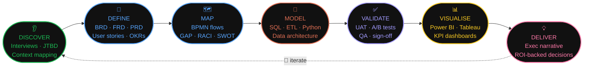

<div align="center">

<br/>

[](https://git.io/typing-svg)

<br/>

```
  ██╗    ███████╗██╗  ██╗████████╗ █████╗ ██████╗ ████████╗██╗  ██╗
  ██║    ██╔════╝██║  ██║╚══██╔══╝██╔══██╗██╔══██╗╚══██╔══╝██║  ██║
  ██║    ███████╗███████║   ██║   ███████║██████╔╝   ██║   ███████║
  ██║    ╚════██║██╔══██║   ██║   ██╔══██║██╔══██╗   ██║   ██╔══██║
  ██║    ███████║██║  ██║   ██║   ██║  ██║██║  ██║   ██║   ██║  ██║
  ██║    ╚══════╝╚═╝  ╚═╝   ╚═╝   ╚═╝  ╚═╝╚═╝  ╚═╝   ╚═╝   ╚═╝  ╚═╝
  ██║       U  M  E  S  H
  ╚═╝
```

[](https://git.io/typing-svg)

<br/>

[](https://www.linkedin.com/in/ishtarth-umesh-497582170/)
[](mailto:ishtarthumesh06@gmail.com)
[](tel:+13392428713)


<br/>


</div>

<br/>

---

<br/>

<div align="center">

```
  ╭─────────────────────────────────────────────────────────────────────────╮
  │                                                                         │
  │   I used to calculate thrust vectors for aircraft.                     │
  │   Now I calculate cost vectors for businesses.                         │
  │                                                                         │
  │   The math is the same. The altitude is different.             ✈️ → 📊  │
  │                                                                         │
  ╰─────────────────────────────────────────────────────────────────────────╯
```

</div>

<br/>

---

## `$ whoami`

```python
ishtarth_umesh = {

    # ── THE BASICS ──────────────────────────────────────────────────────
    "name"         :  "Ishtarth Umesh",
    "based_in"     :  "Boston, MA 🇺🇸  (originally Bengaluru 🇮🇳)",
    "open_to"      :  ["Business Analyst", "Product Analyst", "Strategy & Ops"],

    # ── THE STORY ───────────────────────────────────────────────────────
    "chapter_1"    :  "Aerospace Engineer — BMS College of Engineering (2018–22)",
    "chapter_2"    :  "Business Analyst — KPMG Big 4, 3 years (2022–25)",
    "chapter_3"    :  "MEM Candidate — Tufts University, Boston (2025–27)",

    # ── THE NUMBERS ─────────────────────────────────────────────────────
    "cost_savings" :  "$1,000,000+  identified via ETL & process optimisation",
    "accuracy"     :  "99%  audit accuracy across 5 operational departments",
    "errors_cut"   :  "90%  reduction in data-related discrepancies",
    "etl_speed"    :  "30%  faster ETL processing  →  🏅 Award winning",
    "exec_reach"   :  "20+  senior leaders empowered via real-time dashboards",

    # ── THE AWARDS ──────────────────────────────────────────────────────
    "awards"       :  ["🏅 Client Service Excellence", "⭐ Rising Star — KPMG"],

    # ── THE TOOLS ───────────────────────────────────────────────────────
    "daily_stack"  :  ["SQL", "Python", "Power BI", "Tableau", "Azure", "PySpark"],
    "methods"      :  ["Agile/Scrum", "BPMN", "BABOK", "UAT", "JTBD", "OKRs"],

    # ── THE EDGE ────────────────────────────────────────────────────────
    "superpower"   :  "I translate what the data says into what the business does.",
    "fun_fact"     :  "Aerospace → Analytics. Same systems thinking. Better coffee.",

}
```

<br/>

---

<br/>

## `$ cat impact.log`

<br/>

<div align="center">

```
╔══════════════════════════════════════════════════════════════════════════════╗
║                                                                              ║
║   KPMG GLOBAL DELIVERY CENTER  |  Business Analyst  |  Aug 2022 – Jul 2025  ║
║                                                                              ║
╠══════════╦═══════════════════════════════════╦══════════════════════════════╣
║  METRIC  ║  WHAT I DID                       ║  RESULT                      ║
╠══════════╬═══════════════════════════════════╬══════════════════════════════╣
║  💰 Cost  ║  Agile pipeline design +           ║  $1,000,000+ savings         ║
║          ║  end-to-end process mapping        ║  identified                  ║
╠══════════╬═══════════════════════════════════╬══════════════════════════════╣
║  ✅ Data  ║  Pipeline architecture +           ║  99% audit accuracy          ║
║          ║  data governance across 5 depts    ║  maintained                  ║
╠══════════╬═══════════════════════════════════╬══════════════════════════════╣
║  📉 Error ║  End-to-end validation             ║  90% reduction in            ║
║          ║  framework built & deployed        ║  data discrepancies          ║
╠══════════╬═══════════════════════════════════╬══════════════════════════════╣
║  ⚡ Speed ║  ETL pipeline re-architecture      ║  30% faster processing       ║
║          ║  + full UAT automation             ║  🏅 Award  |  15% audit gain  ║
╠══════════╬═══════════════════════════════════╬══════════════════════════════╣
║  😊 Trust ║  Change management +               ║  +20% stakeholder            ║
║          ║  ETL reliability programme         ║  satisfaction                ║
╠══════════╬═══════════════════════════════════╬══════════════════════════════╣
║  📊 Vis.  ║  5+ SQL + PySpark dashboards for   ║  20+ leaders with live KPIs  ║
║          ║  senior leadership                 ║  → avg +8% efficiency        ║
╠══════════╬═══════════════════════════════════╬══════════════════════════════╣
║  🕐 Time  ║  Enterprise Data Mgmt System       ║  Business insights           ║
║          ║  redesigned end-to-end             ║  24 hours faster             ║
╚══════════╩═══════════════════════════════════╩══════════════════════════════╝
```

</div>

<br/>

---

<br/>

## `$ ls projects/`

<br/>

> 🔨 &nbsp; Three projects. Real data. Public repos. Built to prove the work, not describe it.

<br/>

```
  ┌─────────────────────────────────────────────────────────────────────────┐
  │  📁 /retail-ops-analytics          [ SQL + Power BI Case Study ]        │
  │  📁 /data-validation-engine        [ Python Automation ]                │
  │  📁 /freshstart-food-insights      [ Customer Discovery ]               │
  └─────────────────────────────────────────────────────────────────────────┘
```

<br/>

### &nbsp; 📁 &nbsp; `retail-ops-analytics/`


**What it proves:** End-to-end Product Analyst workflow on the Olist Brazil public dataset.
Not "I made a dashboard." The repo documents *why* each KPI was chosen, *what question* each SQL query answers, and *what decision* the dashboard is designed to trigger.

```
  /01-problem-brief        ← stakeholder questions + success metrics defined first
  /02-sql-models           ← 25+ annotated queries, one business question per file
  /03-kpi-framework        ← KPIs chosen before Power BI is opened, not after
  /04-powerbi-dashboard    ← packaged .pbix + screenshot walkthrough
  /05-insight-memo.pdf     ← the one-pager that gets read in the exec meeting
```

<br/>

### &nbsp; 📁 &nbsp; `data-validation-engine/`


**What it proves:** The Rising Star Award at KPMG came from automating exactly this.
Open-source version: point at any CSV → validates data quality → flags anomalies → generates a formatted Excel report → ready to send to stakeholders. Built for analysts, documented for non-technical readers.

```
  /src/validator.py        ← core validation engine, fully commented
  /src/report_builder.py   ← Excel output formatted for stakeholders
  /tests/                  ← test suite with sample datasets
  /README.md               ← explains the business problem, not just the code
```

<br/>

### &nbsp; 📁 &nbsp; `freshstart-food-insights/`


**What it proves:** Most BAs skip customer discovery. Product Analyst roles require it.
This is a Tufts MEM live research project — end-to-end customer discovery identifying 80%+ of food adaptation challenges faced by newcomers. Delivered as a strategy memo with opportunity sizing.

```
  /research-design         ← interview guide + survey framework
  /synthesis               ← thematic analysis, coded findings
  /insight-report.pdf      ← the output: 70%+ adaptation improvement targeted
```

<br/>

---

<br/>

## `$ cat skills.matrix`

<br/>

<div align="center">

| 🔍 &nbsp; Discovery | 📐 &nbsp; Delivery | 📊 &nbsp; Data & Product | 🤝 &nbsp; Strategy |
|:---|:---|:---|:---|
| Requirements Elicitation | Agile / Scrum | SQL · Advanced | OKR Design & Alignment |
| BRD · FRD · PRD Writing | Sprint Planning & Grooming | Python · Pandas · PySpark | C-Suite Storytelling |
| User Stories + Criteria | UAT Coordination | Power BI + DAX | Cross-Functional Leadership |
| Jobs-to-be-Done (JTBD) | SDLC — Agile & Waterfall | Tableau | Change Management |
| Customer Discovery | RACI Matrix Design | Azure Data Services | Stakeholder Mapping |
| Gap & Impact Analysis | Release Management | ETL Pipeline Design | Executive Presentations |
| SWOT · Cost-Benefit | Risk & Dependency Mapping | Alteryx · Excel | Go-to-Market Support |
| Process Mapping (BPMN) | JIRA · Confluence | Statistical Analysis | Competitive Analysis |
| Root Cause Analysis | Backlog Grooming | Forecasting & OPEX | Product Strategy |
| KPI Framework Design | Data Quality Management | A/B Test Design | BABOK Framework |

</div>

<br/>

---

<br/>

## `$ cat stack.conf`

<br/>

<div align="center">

**[ ANALYTICS CORE ]**


**[ BUSINESS INTELLIGENCE ]**


**[ CLOUD & PLATFORMS ]**


**[ DELIVERY ]**


**[ FRAMEWORKS ]**


</div>

<br/>

---

<br/>

## `$ cat delivery.flow`

<br/>



<br/>

---

<br/>

## `$ cat proficiency.log`

<br/>

```
  ANALYTICS & QUERYING
  ├─ SQL  ·····················  ████████████████████  100%  3yrs production · $1M impact
  ├─ Python  ··················  ████████████████░░░░   80%  automation · award winning
  ├─ PySpark  ·················  ████████████░░░░░░░░   60%  KPMG ETL pipelines
  └─ DAX / Power Query  ·······  ████████████████░░░░   80%  5+ production dashboards

  BUSINESS INTELLIGENCE
  ├─ Power BI  ················  ████████████████████  100%  5+ exec dashboards · 20+ leaders
  ├─ Tableau  ·················  ████████████████░░░░   80%  operational reporting
  ├─ Advanced Excel  ··········  ████████████████████  100%  financial modelling · OPEX
  └─ Alteryx  ·················  ████████████░░░░░░░░   60%  ETL workflow design

  CLOUD & PLATFORMS
  ├─ Microsoft Azure  ·········  ████████████████░░░░   80%  certified · DP-900 + AI
  ├─ SAP  ·····················  ████████████░░░░░░░░   60%  enterprise ERP
  └─ Oracle ERP  ··············  ████████████░░░░░░░░   60%  data pipeline integration

  BA / PA CRAFT
  ├─ Agile / Scrum  ···········  ████████████████████  100%  led sprints · 5 departments
  ├─ Requirements — BRD/FRD  ··  ████████████████████  100%  delivered · Big 4 signed off
  ├─ Process Mapping — BPMN  ··  ████████████████████  100%  end-to-end re-engineering
  ├─ UAT Coordination  ········  ████████████████████  100%  reduced audit time 15%
  ├─ Customer Discovery/JTBD  ·  ████████████░░░░░░░░   65%  FreshStart · Tufts MEM
  ├─ Product Analytics  ·······  ████████████░░░░░░░░   65%  KPI design · funnel analysis
  └─ Financial Modelling  ·····  ████████████░░░░░░░░   65%  Pro Forma · Tufts MEM
```

<br/>

---

<br/>

## `$ cat awards.txt`

<br/>

<div align="center">

```
  ┌───────────────────────────────────────────────────────────────────────┐
  │                                                                       │
  │   🏅  CLIENT SERVICE EXCELLENCE AWARD  ·  KPMG                       │
  │       Reduced ETL processing time by 30% while delivering            │
  │       consistently high-quality and timely client solutions.         │
  │                                                                       │
  │   ⭐  RISING STAR AWARD  ·  KPMG                                      │
  │       Pioneered automated Python data validation processes            │
  │       that significantly improved report accuracy company-wide.      │
  │                                                                       │
  │       Two awards. Three years. Big 4.                                │
  │       That's not luck. That's the work.                              │
  │                                                                       │
  └───────────────────────────────────────────────────────────────────────┘
```

</div>

<br/>

---

<br/>

## `$ cat certifications.txt`

<br/>

<div align="center">


</div>

<br/>

---

<br/>

## `$ cat education.txt`

<br/>

```
  ╔══════════════════════════════════════════════════════════════════════════╗
  ║                                                                          ║
  ║  🎓  MASTER IN ENGINEERING MANAGEMENT                                    ║
  ║      Tufts University  ·  Boston, MA  ·  Sep 2025 – May 2027            ║
  ║                                                                          ║
  ║      Technology Strategy  ·  Financial Intelligence                     ║
  ║      Customer Discovery   ·  Programme & Project Management             ║
  ║      Introduction to Data Analytics                                     ║
  ║                                                                          ║
  ╠══════════════════════════════════════════════════════════════════════════╣
  ║                                                                          ║
  ║  🎓  B.E. AEROSPACE ENGINEERING                                          ║
  ║      BMS College of Engineering  ·  Bengaluru  ·  Aug 2018 – Jun 2022  ║
  ║                                                                          ║
  ║      Systems thinking · Engineering rigour · Precision under pressure  ║
  ║      (All three still apply. Just in boardrooms now, not wind tunnels.) ║
  ║                                                                          ║
  ╚══════════════════════════════════════════════════════════════════════════╝
```

<br/>

---

<br/>

## `$ cat why_me.diff`

<br/>

```diff
  # Every BA resume says the same things.
  # Here is what makes this one different.

- "Proficient in SQL"
+ SQL that found $1,000,000 in cost savings at a Big 4 firm

- "Experience with Agile"
+ Led Agile cross-functional initiatives across 5 departments at KPMG

- "Built dashboards"
+ Dashboards used daily by 20+ senior leaders → averaged +8% efficiency lift

- "Stakeholder management skills"
+ Drove +20% stakeholder satisfaction through change management programmes

- "Python experience"
+ Python automation that won a company-wide Rising Star Award

- "Customer research background"
+ End-to-end JTBD discovery — 80%+ of newcomer food challenges identified

- "Strategic thinker"
+ Aerospace → Big 4 → Tufts MEM
+ That IS systems thinking. It's not a buzzword on my resume.
+ It's a career arc.
```

<br/>

---

<br/>

<div align="center">

```
  ╭──────────────────────────────────────────────────────────────────────╮
  │                                                                      │
  │                   $ reach_out --now                                  │
  │                                                                      │
  │   I don't just fill BA · PA · Strategy & Ops roles.                 │
  │   I make them look easy.                                             │
  │                                                                      │
  │   📞  339-242-8713          Fast reply guaranteed.                  │
  │   📧  ishtarthumesh06@gmail.com                                      │
  │                                                                      │
  ╰──────────────────────────────────────────────────────────────────────╯
```

<br/>

[](https://www.linkedin.com/in/ishtarth-umesh-497582170/)
&nbsp;&nbsp;
[](mailto:ishtarthumesh06@gmail.com)
&nbsp;&nbsp;
[](tel:+13392428713)

<br/>

[](https://git.io/typing-svg)

</div>
