<div align="center">

```
██╗███████╗██╗  ██╗████████╗ █████╗ ██████╗ ████████╗██╗  ██╗
██║██╔════╝██║  ██║╚══██╔══╝██╔══██╗██╔══██╗╚══██╔══╝██║  ██║
██║███████╗███████║   ██║   ███████║██████╔╝   ██║   ███████║
██║╚════██║██╔══██║   ██║   ██╔══██║██╔══██╗   ██║   ██╔══██║
██║███████║██║  ██║   ██║   ██║  ██║██║  ██║   ██║   ██║  ██║
╚═╝╚══════╝╚═╝  ╚═╝   ╚═╝   ╚═╝  ╚═╝╚═╝  ╚═╝   ╚═╝   ╚═╝  ╚═╝
                    U  M  E  S  H
```

[](https://git.io/typing-svg)

<br/>

[](https://www.linkedin.com/in/ishtarth-umesh-497582170/)
[](mailto:ishtarthumesh06@gmail.com)
[](tel:+13392428713)


<br/>


</div>

---

<div align="center">

```
╔═══════════════════════════════════════════════════════════════════════════╗
║                                                                           ║
║   "Between every dataset and every business decision there is a gap.      ║
║    I live in that gap — and I make it smaller every time."                ║
║                                                                           ║
║                                                       — Ishtarth Umesh   ║
╚═══════════════════════════════════════════════════════════════════════════╝
```

</div>

---

## ⚡ &nbsp; Who I Am — In Python

```python
ishtarth = {
    "targeting"   : ["Product Analyst", "Strategy & Operations", "Business Analyst"],
    "trained_by"  : ["KPMG Big 4 (3 yrs)", "Tufts University MEM"],
    "edge"        : "Aerospace → Big 4 → Tufts. I see systems, not just spreadsheets.",
    "impact"      : {
        "cost_savings"   : "$1,000,000+",
        "audit_accuracy" : "99%",
        "error_reduction": "90%",
        "etl_speedup"    : "30% faster",
        "awards"         : ["Client Service Excellence", "Rising Star"],
    },
    "stack"       : ["SQL", "Python", "Power BI", "Tableau", "Azure", "PySpark", "Excel"],
    "methods"     : ["Agile/Scrum", "BPMN", "BABOK", "UAT", "Waterfall", "OKRs", "JTBD"],
    "location"    : "Boston, MA 🇺🇸  |  Open to relocation",
    "status"      : "🟢 Actively interviewing — reach out anytime",
}
```

---

## 🏆 &nbsp; Impact That Speaks Before I Do

```
┌──────────────────────────────────────────────────────────────────────────────┐
│                                                                              │
│   💰 $1M+          📊 99%          📉 90%          ⚡ 30%          🕐 24hrs  │
│   Cost Savings     Audit           Error           Faster ETL      Faster    │
│   Identified       Accuracy        Reduction       Processing      Insights  │
│                                                                              │
│   ⏱️ 15%           😊 +20%         👥 20+          📈 +8%          🏅 2×     │
│   Audit Time       Stakeholder     Exec Leaders    Operational     Award     │
│   Saved            Satisfaction    Empowered       Efficiency      Winner    │
│                                                                              │
└──────────────────────────────────────────────────────────────────────────────┘
```

---

## 🎯 &nbsp; Roles I'm Built For — And Why

<div align="center">

```
┌─────────────────────────────────────────────────────────────────────────────────────┐
│                                                                                     │
│   🔷  PRODUCT ANALYST                                                               │
│   ──────────────────────────────────────────────────────────────────────────────   │
│   I've designed KPI frameworks, built executive dashboards used by 20+ leaders,    │
│   run data validation at scale, and know how to translate user behaviour into      │
│   product decisions. KPMG taught me to quantify everything. Tufts is teaching     │
│   me the strategy layer on top.                                                    │
│                                                                                     │
│   🔶  STRATEGY & OPERATIONS                                                         │
│   ──────────────────────────────────────────────────────────────────────────────   │
│   $1M+ in cost savings wasn't luck — it was process mapping, ETL architecture,    │
│   and relentless OPEX analysis. I've led cross-functional Agile programmes,       │
│   owned change management, and delivered 24-hour faster insight pipelines.        │
│   Strategy is just analysis with consequences. I'm comfortable with both.         │
│                                                                                     │
│   🔹  BUSINESS ANALYST                                                              │
│   ──────────────────────────────────────────────────────────────────────────────   │
│   BRDs. FRDs. UAT. BPMN. RACI. BABOK. Not just words on my resume —              │
│   these are artifacts I've shipped, signed, and handed to dev teams.              │
│   Big 4 BA work is the hardest version of this job. Everything else is easier.   │
│                                                                                     │
└─────────────────────────────────────────────────────────────────────────────────────┘
```

</div>

---

## 📂 &nbsp; Project Portfolio — Real Work, Public & Verifiable

> *Three projects targeting exactly the roles above. Built with real public data. Pinned on this profile.*

---

### &nbsp; 🗂️ 01 — SQL + Power BI: Retail Operations Case Study


**What it is:** End-to-end analytics case study on a public retail / e-commerce dataset (Olist Brazil / AdventureWorks). Demonstrates the full PA workflow: data cleaning → SQL modelling → KPI design → Power BI dashboard → insight narrative.

**What it shows a recruiter:**
```
✔  I define KPIs before I build dashboards — not after
✔  SQL is not a tool I "know" — it's how I think about data structure
✔  Power BI dashboards designed for decisions, not decoration
✔  Written insight narrative = I communicate findings, not just visuals
```
**Stack:** `PostgreSQL` · `Power BI` · `DAX` · `Python (Pandas)` · `GitHub`

---

### &nbsp; 🗂️ 02 — Python Automation: Data Validation & Reporting Pipeline


**What it is:** Open-source version of the Python validation engine I built at KPMG — applied to a public dataset. Automates data quality checks, flags anomalies, and generates a formatted Excel report. Exactly the kind of automation that won me the Rising Star Award.

**What it shows a recruiter:**
```
✔  I automate the painful parts of analysis — not just describe them
✔  My KPMG award-winning approach is documented and reproducible
✔  Clean, commented, production-readable Python code
✔  README explains the business problem, not just the code
```
**Stack:** `Python` · `Pandas` · `OpenPyXL` · `Great Expectations` · `GitHub Actions`

---

### &nbsp; 🗂️ 03 — FreshStart Food Insights: End-to-End Customer Discovery


**What it is:** Full customer discovery research project (Tufts MEM). Interviews + survey synthesis identifying the top food adaptation challenges for people settling into new cities. Delivered as a written insight report with opportunity sizing.

**What it shows a recruiter:**
```
✔  I understand users before I build solutions — JTBD / jobs-to-be-done
✔  Customer discovery is a Product Analyst superpower most BAs skip
✔  Findings: 80%+ of food challenges identified, 70%+ adaptation improvement targeted
✔  Written like a strategy memo, not an academic paper
```
**Stack:** `Customer Interviews` · `Survey Design` · `Thematic Analysis` · `Insight Synthesis` · `Notion`

---

## 🔁 &nbsp; How I Work — The Full Delivery Loop

```mermaid
flowchart LR
    A(["👂 DISCOVER\nStakeholder interviews\nJTBD · Customer research"]) --> B(["📝 DEFINE\nBRD · FRD · PRD\nUser stories · OKRs"])
    B --> C(["🗺️ MAP\nBPMN process flows\nGAP · SWOT · RACI"])
    C --> D(["🔧 MODEL\nSQL · ETL · Python\nData architecture"])
    D --> E(["✅ VALIDATE\nUAT · QA · A/B tests\nAcceptance criteria"])
    E --> F(["📊 VISUALISE\nPower BI · Tableau\nKPI dashboards"])
    F --> G(["💡 DELIVER\nExecutive narrative\nROI-backed decisions"])
    G -.->|"🔁 Iterate & Improve"| A

    style A fill:#0d1117,color:#1db954,stroke:#1db954,stroke-width:2px
    style B fill:#0d1117,color:#0077b5,stroke:#0077b5,stroke-width:2px
    style C fill:#0d1117,color:#00b4d8,stroke:#00b4d8,stroke-width:2px
    style D fill:#0d1117,color:#e17055,stroke:#e17055,stroke-width:2px
    style E fill:#0d1117,color:#a29bfe,stroke:#a29bfe,stroke-width:2px
    style F fill:#0d1117,color:#f9ca24,stroke:#f9ca24,stroke-width:2px
    style G fill:#0d1117,color:#fd79a8,stroke:#fd79a8,stroke-width:2px
```



---

## 🧠 &nbsp; Full Competency Matrix

<div align="center">

| 🔍 Discovery & Analysis | 📐 Delivery & Ops | 📊 Product & Data | 🤝 Strategy & People |
|:---|:---|:---|:---|
| Requirements Elicitation | Agile / Scrum | SQL (Advanced) | OKR Design & Alignment |
| BRD / FRD / PRD Writing | Sprint Planning | Python + Pandas | C-Suite Storytelling |
| User Story Writing | UAT Coordination | Power BI + DAX | Cross-Functional Leadership |
| Jobs-to-be-Done (JTBD) | SDLC (Agile + Waterfall) | Tableau | Stakeholder Mapping |
| Customer Discovery | RACI Matrix Design | PySpark | Change Management |
| Gap & Impact Analysis | Release Management | Azure Data Services | Executive Presentations |
| SWOT / Cost-Benefit | Risk & Dependency Mapping | ETL Pipeline Design | Workshop Facilitation |
| Process Mapping (BPMN) | JIRA / Confluence | Alteryx + Excel | Competitive Analysis |
| Root Cause Analysis | Roadmap Planning | Statistical Analysis | Go-to-Market Support |
| KPI Framework Design | Data Quality Management | Forecasting Models | Vendor Management |
| OPEX / Financial Analysis | A/B Test Design | SAP / Oracle ERP | Product Strategy |
| Funnel Analysis | Backlog Grooming | Data Governance | BABOK Framework |

</div>

---

## 🛠️ &nbsp; Tech Stack

<div align="center">

**[ ANALYTICS CORE ]**


**[ BUSINESS INTELLIGENCE ]**


**[ CLOUD & PLATFORMS ]**


**[ DELIVERY TOOLS ]**


**[ FRAMEWORKS ]**


</div>

---

## 💼 &nbsp; KPMG — Where The Numbers Came From

<div align="center">

`🏢 KPMG Global Delivery Center` &nbsp;·&nbsp; `Business Analyst` &nbsp;·&nbsp; `Aug 2022 – Jul 2025`

</div>

| # | Business Problem | My Solution | Outcome |
|:---:|:---|:---|:---:|
| 1 | Runaway costs across data pipelines | Agile cross-functional initiative + process mapping | **$1M+ saved** |
| 2 | Audit errors across 5 departments | Pipeline architecture + data governance | **99% accuracy** |
| 3 | Slow manual validation cycles | Automated UAT workflows end-to-end | **15% faster** |
| 4 | Data discrepancies undermining reports | End-to-end validation framework | **90% reduction** |
| 5 | Stakeholder distrust in data | ETL optimisation + change management | **+20% satisfaction** |
| 6 | Slow insight delivery to leadership | Enterprise Data Management System | **24 hrs faster** |
| 7 | No KPI visibility for leadership | 5+ SQL + PySpark dashboards | **+8% efficiency** |
| 8 | ETL bottlenecks slowing everything | Pipeline re-architecture end-to-end | **30% faster 🏅** |
| 9 | Manual report validation prone to error | Python automated validation engine | **Award winning ⭐** |

---

## 📦 &nbsp; Artifacts I Ship — Not Theories I Discuss

```
  ◉  Business Requirements Documents (BRD)       — stakeholder-signed, zero ambiguity
  ◉  Functional Requirements Documents (FRD)      — dev-ready, testable, traceable
  ◉  Product Requirements Documents (PRD)         — outcome-first, not feature-first
  ◉  Process Maps & BPMN Swimlane Diagrams        — every exception, every edge case
  ◉  User Stories + Acceptance Criteria           — written for devs AND QA
  ◉  Executive Power BI & Tableau Dashboards      — decision-grade, not decorative
  ◉  UAT Test Plans & Sign-off Packages           — nothing ships unvalidated
  ◉  RACI Matrices & Stakeholder Registers        — no confusion, ever
  ◉  KPI Frameworks & OPEX Reports                — tied to real business outcomes
  ◉  Customer Discovery Research Reports          — insights, not just data
  ◉  ETL Architecture Documentation               — built to survive team turnover
  ◉  Root Cause Analysis Reports                  — five whys, every time
```

---

## 🌟 &nbsp; The Real Differentiator

```
┌──────────────────────────────────────┬─────────────────────────────────────────────┐
│   What Most Candidates Say           │   What My Profile Proves                    │
├──────────────────────────────────────┼─────────────────────────────────────────────┤
│  "Proficient in SQL"                 │  SQL that found $1M in cost savings         │
│  "Experience with Agile"             │  Led Agile initiatives across 5 departments │
│  "Built dashboards"                  │  Dashboards used daily by 20+ exec leaders  │
│  "Stakeholder management"            │  Drove +20% satisfaction score at Big 4     │
│  "Python skills"                     │  Python that won a company-wide award       │
│  "Customer research experience"      │  FreshStart: 80%+ challenges identified     │
│  "Strategic mindset"                 │  Aerospace → Big 4 → Tufts MEM. That IS    │
│                                      │  systems thinking. Not a buzzword.          │
└──────────────────────────────────────┴─────────────────────────────────────────────┘
```

---

## 🏅 &nbsp; Certifications

<div align="center">


</div>

---

## 🎓 &nbsp; Education

```
╔══════════════════════════════════════════════════════════════════════════════╗
║  🎓  MASTER IN ENGINEERING MANAGEMENT                                        ║
║      Tufts University  ·  Boston, MA  ·  Sep 2025 – May 2027                ║
║                                                                              ║
║      Technology Strategy  ·  Financial Intelligence  ·  Customer Discovery  ║
║      Program & Project Management  ·  Introduction to Data Analytics        ║
╠══════════════════════════════════════════════════════════════════════════════╣
║  🎓  B.E. AEROSPACE ENGINEERING                                               ║
║      BMS College of Engineering  ·  Bengaluru  ·  2018 – 2022               ║
║                                                                              ║
║      Systems thinking + engineering rigour applied to every analysis        ║
╚══════════════════════════════════════════════════════════════════════════════╝
```

---

## 📊 &nbsp; Skill Depth — Honest & Verifiable

```
ANALYTICS & QUERYING
  SQL (Advanced)              ████████████████████  100%   3 yrs · KPMG production use
  Python                      ████████████████░░░░   80%   Automation · Pandas · Award winner
  PySpark                     ████████████░░░░░░░░   60%   KPMG ETL pipelines
  DAX / Power Query           ████████████████░░░░   80%   5+ production dashboards

BUSINESS INTELLIGENCE
  Power BI                    ████████████████████  100%   5+ exec dashboards · 20+ leaders
  Tableau                     ████████████████░░░░   80%   Operational reporting
  Advanced Excel              ████████████████████  100%   Financial modelling · OPEX
  Alteryx                     ████████████░░░░░░░░   60%   ETL workflow design

CLOUD & PLATFORMS
  Microsoft Azure             ████████████████░░░░   80%   Certified · DP-900 + AI cert
  SAP                         ████████████░░░░░░░░   60%   Enterprise ERP workflows
  Oracle ERP                  ████████████░░░░░░░░   60%   Data pipeline integration

BA / PA METHODOLOGY
  Agile / Scrum               ████████████████████  100%   Led sprints across 5 departments
  Requirements (BRD/FRD)      ████████████████████  100%   Delivered & signed off at Big 4
  Process Mapping (BPMN)      ████████████████████  100%   End-to-end process re-engineering
  UAT Coordination            ████████████████████  100%   Reduced audit time 15%
  Customer Discovery / JTBD   ████████████░░░░░░░░   65%   FreshStart · Tufts MEM project
  Product Analytics           ████████████░░░░░░░░   65%   KPI frameworks · Funnel design
  Financial Modelling         ████████████░░░░░░░░   65%   Pro Forma · Tufts MEM project
```

---

<div align="center">

```
╔═══════════════════════════════════════════════════════════════════════════╗
║                                                                           ║
║                 📬   LET'S TALK                                           ║
║                                                                           ║
║   I don't just fill BA · PA · S&O roles. I make them look easy.          ║
║   Reach out — I respond fast.                                             ║
║                                                                           ║
╚═══════════════════════════════════════════════════════════════════════════╝
```

[](https://www.linkedin.com/in/ishtarth-umesh-497582170/)
&nbsp;
[](mailto:ishtarthumesh06@gmail.com)
&nbsp;
[](tel:+13392428713)

<br/>

[](https://git.io/typing-svg)

</div>
