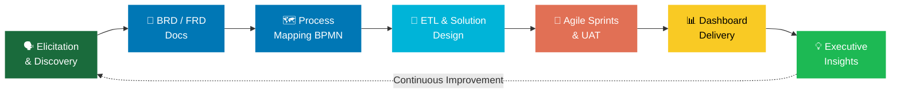

<div align="center">

# 👋 Hi, I'm Ishtarth Umesh

### `Senior Business Analyst` · `Big 4 Trained @ KPMG` · `Data & Strategy Professional`

<br/>

[](https://git.io/typing-svg)

<br/>

[](https://www.linkedin.com/in/ishtarth-umesh-497582170/)
[](mailto:ishtarthumesh06@gmail.com)
[](tel:+13392428713)

<br/>


</div>

<br/>

---

<div align="center">

## ━━━━━━━━━━━━━━━━━━━━━━━━━━━━━━━━━━━━
## 💡 The 30-Second Pitch
## ━━━━━━━━━━━━━━━━━━━━━━━━━━━━━━━━━━━━

</div>

<br/>

<table>
<tr>
<td width="58%">

**I'm a Big 4-trained Business Analyst** who bridges the gap between raw data and executive decisions that actually move the needle.

I speak two languages fluently: **SQL and C-Suite.**

At KPMG, I identified **$1M+ in cost savings**, maintained **99% audit accuracy** across 5 departments, reduced data errors by **90%**, and won **two performance awards** — all while leading Agile cross-functional teams across Finance, Operations, and Audit.

Now at **Tufts University** (MEM, Class of 2027), I'm combining deep technical BA skills with strategic business thinking.

</td>
<td width="42%">

```yaml
Name     : Ishtarth Umesh
Role     : Senior Business Analyst
Company  : KPMG Global Delivery Center
Duration : 3 Years  │  Aug 2022–Jul 2025
─────────────────────────────────────────
Impact   : $1M+ Cost Savings Identified
Awards   : 2× Performance Award Winner
Accuracy : 99% Audit Accuracy Achieved
Errors   : 90% Reduction in Data Issues
─────────────────────────────────────────
School   : Tufts University MEM (2027)
Location : Boston, MA 🇺🇸
Origin   : Bengaluru, India 🇮🇳
```

</td>
</tr>
</table>

---

<div align="center">

## ━━━━━━━━━━━━━━━━━━━━━━━━━━━━━━━━━━━━
## 🏆 Quantified Business Impact
## ━━━━━━━━━━━━━━━━━━━━━━━━━━━━━━━━━━━━

</div>

<br/>

<div align="center">

| 💰 | 📊 | 📉 | ⚡ |
|:---:|:---:|:---:|:---:|
| **$1,000,000+** | **99%** | **90%** | **30%** |
| Cost Savings Identified | Audit Accuracy | Error Reduction | Faster ETL |
| ETL & Process Optimization | Across 5+ Departments | Data Validation Automation | 🏅 Award Winning |

| ⏱️ | 😊 | 📈 | 👥 |
|:---:|:---:|:---:|:---:|
| **15%** | **+20%** | **+8% avg** | **24 hrs** |
| Audit Time Saved | Stakeholder Satisfaction | Operational Efficiency | Faster Insights |
| via UAT Automation | Finance & Ops Teams | Across 20+ Executives | Streamlined Pipelines |

</div>

---

<div align="center">

## ━━━━━━━━━━━━━━━━━━━━━━━━━━━━━━━━━━━━
## 🎯 Core BA Competencies
## ━━━━━━━━━━━━━━━━━━━━━━━━━━━━━━━━━━━━

</div>

<div align="center">

| 🧠 Business Analysis | 📐 Process & Delivery | 📊 Data & BI | 🤝 Stakeholder Mgmt |
|:---|:---|:---|:---|
| Requirements Elicitation | Agile / Scrum | SQL & PySpark | C-Suite Reporting |
| BRD / FRD Writing | Sprint Planning | Power BI / Tableau | Cross-Functional Leadership |
| User Stories & Use Cases | UAT Coordination | Python Automation | Change Management |
| Gap & Impact Analysis | SDLC (Agile + Waterfall) | ETL Pipeline Design | Stakeholder Mapping |
| SWOT / Cost-Benefit | RACI Matrix Design | Azure Data Services | Executive Presentations |
| Process Mapping (BPMN) | Release Management | Data Modeling | Workshop Facilitation |
| Root Cause Analysis | Risk Assessment | A/B Testing | Vendor Management |
| KPI Design & Tracking | Data Governance | Forecasting & OPEX | Conflict Resolution |

</div>

---

<div align="center">

## ━━━━━━━━━━━━━━━━━━━━━━━━━━━━━━━━━━━━
## 🛠️ Full Tech Stack
## ━━━━━━━━━━━━━━━━━━━━━━━━━━━━━━━━━━━━

**🔢 Languages & Querying**


<br/>

**📊 BI, Visualization & Reporting**


<br/>

**☁️ Cloud, Platforms & ERP**


<br/>

**🔄 Project & Collaboration Tools**


<br/>

**📐 Methodologies & Frameworks**


</div>

---

<div align="center">

## ━━━━━━━━━━━━━━━━━━━━━━━━━━━━━━━━━━━━
## 🔁 The BA Lifecycle — How I Work
## ━━━━━━━━━━━━━━━━━━━━━━━━━━━━━━━━━━━━

</div>



---

<div align="center">

## ━━━━━━━━━━━━━━━━━━━━━━━━━━━━━━━━━━━━
## 💼 KPMG Experience — Full Impact
## ━━━━━━━━━━━━━━━━━━━━━━━━━━━━━━━━━━━━

</div>

**🏢 KPMG Global Delivery Center | Business Analyst | Aug 2022 – Jul 2025 | Bengaluru, India**

| Domain | What I Did | Measurable Outcome |
|:---|:---|:---|
| **Cost Optimization** | Led Agile cross-functional data pipeline design | **$1M+** in cost savings identified |
| **Data Governance** | Implemented robust pipeline architectures | **99%** audit accuracy across 5 departments |
| **Process Automation** | Built automated UAT validation workflows | **15%** reduction in audit time |
| **Data Quality** | End-to-end validation & discrepancy frameworks | **90%** drop in data errors |
| **Stakeholder Relations** | ETL optimization + change management | **+20%** stakeholder satisfaction |
| **Insight Delivery** | Developed Enterprise Data Management System | Insights delivered **24 hrs faster** |
| **Executive Dashboards** | 5+ dashboards using SQL & PySpark | **20+ leaders** with real-time KPIs → **+8% efficiency** |
| **ETL Speed** | End-to-end ETL processing optimization | **30% faster** → 🏅 Client Service Excellence Award |
| **Python Automation** | Automated data validation pipeline | Report accuracy significantly improved → ⭐ Rising Star Award |

---

<div align="center">

## ━━━━━━━━━━━━━━━━━━━━━━━━━━━━━━━━━━━━
## 📦 BA Artifacts I've Delivered
## ━━━━━━━━━━━━━━━━━━━━━━━━━━━━━━━━━━━━

</div>

```
  ✅  Business Requirements Documents (BRDs)
  ✅  Functional Requirements Documents (FRDs)
  ✅  Process Maps & BPMN Swimlane Diagrams
  ✅  5+ Executive Power BI / Tableau Dashboards
  ✅  Enterprise Data Management System
  ✅  Automated Python Data Validation Engine
  ✅  RACI Matrices & Stakeholder Maps
  ✅  UAT Test Plans & Sign-off Documentation
  ✅  KPI Frameworks & OPEX Reporting Templates
  ✅  ETL Pipeline Architecture Documentation
```

---

<div align="center">

## ━━━━━━━━━━━━━━━━━━━━━━━━━━━━━━━━━━━━
## 🌟 What Makes Me Different
## ━━━━━━━━━━━━━━━━━━━━━━━━━━━━━━━━━━━━

| 🔴 Most BA Candidates... | 🟢 Ishtarth Delivers... |
|:---|:---|
| List tools they know | **Business outcomes** those tools created |
| Come from one domain | Spans **Finance, Audit, Ops & Product** |
| Work in one methodology | Shipped in **Agile AND Waterfall SDLC** |
| Report data to leadership | **Influences** decisions at the C-suite level |
| Build static reports | Builds **decision-enabling insight systems** |
| Just analyze problems | **Leads** cross-functional initiatives end-to-end |
| Speak tech jargon | Fluently translates **tech ↔ business language** |

</div>

---

<div align="center">

## ━━━━━━━━━━━━━━━━━━━━━━━━━━━━━━━━━━━━
## 🚀 Current Projects @ Tufts
## ━━━━━━━━━━━━━━━━━━━━━━━━━━━━━━━━━━━━

</div>

```yaml
Project 1 — Pro Forma Financial Reporting:
  Status : 🟡 In Progress (Sep 2025 – Present)
  Goal   : Model financial statements to project company performance
           and support investment decision scenarios
  Skills : Financial Modeling · Scenario Analysis · Excel · Decision Support

Project 2 — FreshStart Food Insights:
  Status : 🟡 In Progress (Sep 2025 – Present)
  Goal   : Customer discovery to identify 80%+ of food challenges for
           newcomers — informing solutions to improve adaptation by 70%+
  Skills : Customer Discovery · Research Design · UX Research · Insight Generation
```

---

<div align="center">

## ━━━━━━━━━━━━━━━━━━━━━━━━━━━━━━━━━━━━
## 🏅 Certifications
## ━━━━━━━━━━━━━━━━━━━━━━━━━━━━━━━━━━━━


</div>

---

<div align="center">

## ━━━━━━━━━━━━━━━━━━━━━━━━━━━━━━━━━━━━
## 🎓 Education
## ━━━━━━━━━━━━━━━━━━━━━━━━━━━━━━━━━━━━

| 🎓 Degree | 🏛️ Institution | 📅 Period |
|:---|:---|:---|
| **Master in Engineering Management** | Tufts University, Boston MA | Sep 2025 – May 2027 |
| **B.E. Aerospace Engineering** | BMS College of Engineering, Bengaluru | Aug 2018 – Jun 2022 |

*Tufts coursework: Technology Strategy · Financial Intelligence · Customer Discovery · Program Management · Data Analytics*

</div>

---

<div align="center">

## ━━━━━━━━━━━━━━━━━━━━━━━━━━━━━━━━━━━━
## 📊 GitHub Stats
## ━━━━━━━━━━━━━━━━━━━━━━━━━━━━━━━━━━━━

[](https://github.com/IshtarthUmesh)
[](https://github.com/IshtarthUmesh)

</div>

---

<div align="center">

## ━━━━━━━━━━━━━━━━━━━━━━━━━━━━━━━━━━━━━━━━━━━
## 📬 Ready to Talk? Let's Connect.
## ━━━━━━━━━━━━━━━━━━━━━━━━━━━━━━━━━━━━━━━━━━━

*"I turn your messiest data problems into your clearest competitive advantage."*

<br/>

[](https://www.linkedin.com/in/ishtarth-umesh-497582170/)
&nbsp;
[](mailto:ishtarthumesh06@gmail.com)
&nbsp;
[](tel:+13392428713)

<br/><br/>

```
╔══════════════════════════════════════════════════════════════════╗
║                                                                  ║
║         Big 4 Trained.  Impact Proven.  Ready to Deliver.        ║
║                                                                  ║
╚══════════════════════════════════════════════════════════════════╝
```

</div>
