<div align="center">



</div>

<div align="center">

[](https://www.linkedin.com/in/ishtarth-umesh-497582170/)
&nbsp;
[](mailto:ishtarthumesh06@gmail.com)
&nbsp;
[](https://www.linkedin.com/in/ishtarth-umesh-497582170/)
&nbsp;
[](https://github.com/IshtarthUmesh)

</div>

<br/>

---

<br/>

Aerospace engineer who got bored designing things that fly and started designing systems that **decide**. Three years at **KPMG** building data pipelines, validation frameworks, and executive dashboards for Fortune 500 clients. Now at **Tufts** earning my MEM while shipping everything I promised clients I would — but never had time to build.

> I don't make dashboards. I answer questions with data, and the dashboard is just the receipt.

<br/>

---

## Impact

<div align="center">

<table>
<tr>
<td align="center" width="200"><h2>$1M+</h2>Cost savings identified<br/><sub>Agile pipeline redesign · KPMG</sub></td>
<td align="center" width="200"><h2>99%</h2>Audit accuracy<br/><sub>5-department governance build</sub></td>
<td align="center" width="200"><h2>90%</h2>Error reduction<br/><sub>End-to-end validation framework</sub></td>
<td align="center" width="200"><h2>30%</h2>Faster ETL processing<br/><sub>Award-winning automation</sub></td>
</tr>
<tr>
<td align="center" colspan="2"><h2>20+</h2>Executives using my dashboards daily<br/><sub>SQL + PySpark reporting suite</sub></td>
<td align="center" colspan="2"><h2>+20%</h2>Stakeholder satisfaction lift<br/><sub>Change management programme</sub></td>
</tr>
</table>

</div>

<br/>

---

## Projects

> Real work. Real data. Real decisions. Not tutorial clones.

<br/>

### [retail-operations-analytics](https://github.com/IshtarthUmesh/retail-operations-analytics)

&nbsp;
&nbsp;
&nbsp;


End-to-end product analyst workflow on the Olist Brazil public dataset. Every SQL query is annotated with the business question it answers. Every KPI traces back to a stakeholder decision it was built to trigger. This is the difference between an analyst who makes charts and one who changes behaviour.
```
problem-brief/     → stakeholder questions defined before a single query was written
sql-models/        → 25+ annotated queries, one business question each
kpi-framework/     → why each metric exists, not just what it measures
powerbi-dashboard/ → .pbix file + screenshots
insight-memo.pdf   → the one-pager that actually gets read
```

<br/>

### [data-validation-engine](https://github.com/IshtarthUmesh/data-validation-engine)

&nbsp;
&nbsp;
&nbsp;


The tool that won me KPMG's Rising Star Award — rebuilt clean and open-sourced. Point it at any CSV. It validates, flags anomalies, and generates a stakeholder-ready Excel report. Designed so the person reading the output doesn't need to understand the code that produced it.
```python
from validator import DataValidator

dv = DataValidator("your_data.csv")
dv.validate(
    required_columns=["order_id", "amount"],
    numeric_ranges={"amount": (0, 1_000_000)}
)
dv.export_report("validation_report.xlsx")
```

<br/>

### [freshstart-food-insights](https://github.com/IshtarthUmesh/freshstart-food-insights)

&nbsp;
&nbsp;
&nbsp;


Live Tufts research applying Jobs-to-Be-Done to food adaptation challenges among international students and immigrants in Boston. Most product analysts skip customer discovery. Product roles require it. This is the piece most portfolios are missing.
```
research-design/  → interview guide, survey framework, sampling strategy
synthesis/        → thematic coding, affinity diagram, JTBD map
insight-report/   → strategy memo with opportunity sizing
```

<br/>

---

## Stack

**Analytics & visualisation**


**Cloud & enterprise platforms**


**Methods & tooling**


<br/>

---

## How I work
```
Discover  ›  Define  ›  Map  ›  Build  ›  Validate  ›  Visualise  ›  Deliver  ›  repeat

👂 JTBD interviews     📝 BRD / FRD / User stories     🗺  BPMN process flows
🔧 SQL + Python        ✅ UAT & QA testing              📊 Power BI / Tableau
💡 Insight memo that drives a decision — not just a report that describes one
```

<br/>

---

## Background
```
2018 – 2022   B.E. Aerospace Engineering          BMS College of Engineering · Bengaluru
              Systems thinking. Engineering under pressure. Root cause over symptoms.
              Applied all of it to business instead.

2022 – 2025   Business Analyst                    KPMG Big 4 · Bengaluru → Boston
              ETL pipelines · data governance · executive dashboards · UAT
              2× company-wide awards. $1M+ in savings identified.

2025 – 2027   Master of Engineering Management    Tufts University · Boston, MA
              Technology strategy · financial intelligence · product & customer discovery
              Building the portfolio I always wanted to ship.
```

<br/>

---

## Certifications


<br/>

---

## Activity

<div align="center">


&nbsp;


<br/><br/>


</div>

<br/>

---

## Let's talk

I respond the same day. If you've read this far you probably have something worth saying.

<div align="center">

[](https://www.linkedin.com/in/ishtarth-umesh-497582170/)
&nbsp;&nbsp;
[](mailto:ishtarthumesh06@gmail.com)

</div>

<br/>

---

<div align="center">
<sub>Last updated March 2026 · Boston, MA</sub>
</div>
