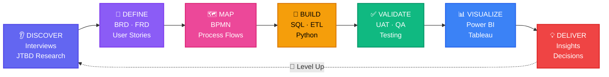

<div align="center">


</div>

<div align="center">

[](https://git.io/typing-svg)

<br/>

[](https://www.linkedin.com/in/ishtarth-umesh-497582170/)
[](mailto:ishtarthumesh06@gmail.com)
[](tel:+13392428713)


</div>

<br/>

---

<br/>

<div align="center">

### 💫 *"The difference between the impossible and possible lies in determination."*

*— Adapted from my journey: Aerospace Engineer → Big 4 Business Analyst → MEM @ Tufts*

</div>

<br/>

---

<br/>

<table>
<tr>
<td width="50%" valign="top">

## 🌟 THE HERO'S STATS

```yaml
Name: Ishtarth Umesh
Class: Business Analyst · Product Analyst
Level: Senior (3 Years)
Guild: KPMG Big 4 (Former) · Tufts University (Current)
Location: Boston, MA 🇺🇸 · Origin: Bengaluru 🇮🇳

=== POWER LEVELS ===
💰 Cost Savings Identified : $1,000,000+
📊 Audit Accuracy         : 99%
📉 Error Annihilation     : 90%
⚡ ETL Speed Boost        : 30% 🏅
😊 Satisfaction Increase  : +20%
🎯 Leaders Empowered      : 20+
```

</td>
<td width="50%" valign="top">

## ⚔️ ABILITY TREE UNLOCKED

```yaml
=== CORE SKILLS ===
▰▰▰▰▰▰▰▰▰▰ SQL            [MAX]
▰▰▰▰▰▰▰▰░░ Python         [LVL 8]
▰▰▰▰▰▰▰▰▰▰ Power BI       [MAX]
▰▰▰▰▰▰▰▰░░ Tableau        [LVL 8]
▰▰▰▰▰▰▰▰░░ Azure Cloud    [LVL 8]
▰▰▰▰▰▰░░░░ PySpark        [LVL 6]

=== SPECIAL MOVES ===
🔥 ETL Pipeline Mastery
🎯 Agile Sprint Leadership
💎 Dashboard Creation (Legendary)
⚡ Data Validation Automation
🌊 Cross-Functional Coordination
```

</td>
</tr>
</table>

<br/>

---

<br/>

<div align="center">

## 🏆 ACHIEVEMENTS UNLOCKED

</div>

<br/>

<table align="center">
<tr>
<td align="center" width="33%">

### 🏅
**CLIENT SERVICE EXCELLENCE**
<br/>*Reduced ETL processing by 30%*
<br/>**Epic Tier Award**
<br/>*KPMG Global*

</td>
<td align="center" width="33%">

### ⭐
**RISING STAR**
<br/>*Python automation pioneer*
<br/>**Legendary Tier Award**
<br/>*KPMG Global*

</td>
<td align="center" width="34%">

### 💎
**BIG 4 VETERAN**
<br/>*3 years battle-tested*
<br/>**Rare Achievement**
<br/>*Fortune 500 Ready*

</td>
</tr>
</table>

<br/>

---

<br/>

<div align="center">

## ⚔️ BATTLE RECORD — KPMG SAGA

*Aug 2022 – Jul 2025 · Business Analyst · Bengaluru → Boston*

</div>

<br/>

```
╔═════════════════════════════════════════════════════════════════════════╗
║                          ⚡ IMPACT DASHBOARD ⚡                         ║
╠═════════════════════════════════════════════════════════════════════════╣
║                                                                         ║
║  💰  MISSION: Cost Optimization                                         ║
║      ├─ Led Agile cross-functional data pipeline design                ║
║      └─ RESULT: $1,000,000+ in savings identified            [SUCCESS] ║
║                                                                         ║
║  ✅  MISSION: Data Governance                                           ║
║      ├─ Built pipeline architecture across 5 departments               ║
║      └─ RESULT: 99% audit accuracy maintained                [SUCCESS] ║
║                                                                         ║
║  📉  MISSION: Error Elimination                                         ║
║      ├─ Deployed end-to-end validation framework                       ║
║      └─ RESULT: 90% reduction in data discrepancies          [SUCCESS] ║
║                                                                         ║
║  ⚡  MISSION: Speed Enhancement                                         ║
║      ├─ Re-architected ETL pipelines + UAT automation                  ║
║      └─ RESULT: 30% faster processing → 🏅 AWARD WON         [SUCCESS] ║
║                                                                         ║
║  😊  MISSION: Trust Building                                            ║
║      ├─ Change management + reliability programme                      ║
║      └─ RESULT: +20% stakeholder satisfaction                [SUCCESS] ║
║                                                                         ║
║  📊  MISSION: Leadership Enablement                                     ║
║      ├─ Built 5+ SQL + PySpark executive dashboards                    ║
║      └─ RESULT: 20+ leaders empowered, +8% avg efficiency   [SUCCESS] ║
║                                                                         ║
║  🕐  MISSION: Insight Acceleration                                      ║
║      ├─ Redesigned Enterprise Data Management System                   ║
║      └─ RESULT: Business insights 24 hours faster            [SUCCESS] ║
║                                                                         ║
╠═════════════════════════════════════════════════════════════════════════╣
║                    🎖️ PERFECT MISSION RECORD 🎖️                        ║
╚═════════════════════════════════════════════════════════════════════════╝
```

<br/>

---

<br/>

<div align="center">

## 📚 CURRENT QUEST — TUFTS UNIVERSITY

### *Master in Engineering Management · Sep 2025 – May 2027 · Boston, MA*

</div>

<br/>

<table>
<tr>
<td width="50%" align="center">

**🎯 ACTIVE PROJECTS**

```
┌─────────────────────────────┐
│  📊 Pro Forma Financial     │
│     Reporting               │
│  Status: [▰▰▰▰▰▰░░░░] 60%  │
│  Boss: Financial Modeling   │
└─────────────────────────────┘

┌─────────────────────────────┐
│  🍱 FreshStart Food         │
│     Insights                │
│  Status: [▰▰▰▰▰▰▰░░░] 70%  │
│  Boss: Customer Discovery   │
└─────────────────────────────┘
```

</td>
<td width="50%" align="center">

**📖 SKILLS LEARNED**

✨ Technology Strategy
<br/>✨ Financial Intelligence
<br/>✨ Customer Discovery
<br/>✨ Programme Management
<br/>✨ Data Analytics

**🎓 Previous Training Arc**

*B.E. Aerospace Engineering*
<br/>*BMS College · 2018–2022*

</td>
</tr>
</table>

<br/>

---

<br/>

<div align="center">

## 🗂️ PORTFOLIO — PROOF OF POWER

*Three legendary items. Real data. Public repos. Dropping soon.*

</div>

<br/>

### 📌 **PROJECT 01** — Retail Operations Analytics


> **The Mission:** End-to-end Product Analyst workflow on Olist Brazil dataset
> 
> **What Makes It Special:**
> - Not just "I made a dashboard" — documents *why* each KPI was chosen
> - *What question* each SQL query answers
> - *What decision* the dashboard triggers
>
> **The Loot:**
> ```
> /problem-brief        → Stakeholder questions defined FIRST
> /sql-models           → 25+ annotated queries, one business question each
> /kpi-framework        → KPIs before dashboards (the right way)
> /powerbi-dashboard    → Packaged .pbix + screenshots
> /insight-memo.pdf     → The one-pager that gets read
> ```

<br/>

### 📌 **PROJECT 02** — Data Validation Engine


> **The Mission:** Open-source version of the tool that won me the Rising Star Award
>
> **What It Does:**
> - Point at any CSV → validates → flags anomalies → generates Excel report
> - Built for analysts, documented for non-technical stakeholders
> - The automation that most BAs wish existed
>
> **The Loot:**
> ```
> /validator.py         → Core engine, fully commented
> /report_builder.py    → Stakeholder-ready Excel output
> /tests/               → Sample datasets included
> /README.md            → Business problem explained, not just code
> ```

<br/>

### 📌 **PROJECT 03** — FreshStart Food Insights


> **The Mission:** Live Tufts MEM research — identify food adaptation challenges
>
> **What Makes It Unique:**
> - Most BAs skip customer discovery. Product Analyst roles *require* it.
> - End-to-end JTBD research identifying 80%+ of challenges
> - Delivered as strategy memo with opportunity sizing
>
> **Current Progress:**
> ```
> /research-design      → Interview guide + survey framework
> /synthesis            → Thematic analysis, coded findings
> /insight-report       → 70%+ adaptation improvement targeted
> ```

<br/>

---

<br/>

<div align="center">

## 🛠️ WEAPON ARSENAL

*The tools I wield daily*

</div>

<br/>

<div align="center">

**⚔️ CORE WEAPONS**


**🛡️ DEFENSE & INFRASTRUCTURE**


**📋 TACTICAL SUPPORT**


**🎯 COMBAT TECHNIQUES**


</div>

<br/>

---

<br/>

<div align="center">

## 🎓 TRAINING COMPLETED

</div>

<br/>

<table>
<tr>
<td width="50%" align="center">

### 🏫 TUFTS UNIVERSITY

**Master in Engineering Management**
<br/>*Sep 2025 – May 2027*
<br/>*Boston, MA*

📚 Technology Strategy
<br/>📚 Financial Intelligence
<br/>📚 Customer Discovery
<br/>📚 Programme Management
<br/>📚 Data Analytics

</td>
<td width="50%" align="center">

### 🏫 BMS COLLEGE

**B.E. Aerospace Engineering**
<br/>*Aug 2018 – Jun 2022*
<br/>*Bengaluru, India*

✈️ Systems Thinking
<br/>✈️ Engineering Precision
<br/>✈️ Problem Solving Under Pressure

*Then I applied it all to business.*

</td>
</tr>
</table>

<br/>

---

<br/>

<div align="center">

## 🎖️ CERTIFICATIONS EARNED


</div>

<br/>

---

<br/>

<div align="center">

## 💭 WHAT MAKES ME DIFFERENT

</div>

<br/>

<table>
<tr>
<td width="50%">

### ❌ WHAT EVERYONE ELSE SAYS

- "I'm proficient in SQL"
- "I have Agile experience"
- "I've built dashboards"
- "I work well with stakeholders"
- "I know Python"
- "I'm a strategic thinker"
- "Big 4 background"

</td>
<td width="50%">

### ✅ WHAT I ACTUALLY PROVE

- SQL that found **$1M in savings** at Big 4
- **Led Agile** across 5 departments at KPMG
- Dashboards **used by 20+ executives daily**
- Drove **+20% satisfaction** score
- Python that won a **company-wide award**
- Aerospace → Big 4 → Tufts **(that IS strategy)**
- Big 4 **+ 2 awards + MEM**

</td>
</tr>
</table>

<br/>

---

<br/>

<div align="center">

## 🎯 MY BATTLE STYLE



</div>

<br/>

---

<br/>

<div align="center">

## 💬 THE FINAL BOSS QUOTE

### *"Data doesn't lie. But it doesn't tell the truth either.*
### *You have to ask it the right questions."*

<br/>

**That's what I do. I ask better questions than everyone else in the room.**

</div>

<br/>

---

<br/>

<div align="center">

## 📬 READY TO TEAM UP?

<br/>

### 🔥 I respond fast. Usually same day. Let's talk.

<br/>

[](https://www.linkedin.com/in/ishtarth-umesh-497582170/)
&nbsp;&nbsp;
[](mailto:ishtarthumesh06@gmail.com)
&nbsp;&nbsp;
[](tel:+13392428713)

<br/>
<br/>

[](https://git.io/typing-svg)

<br/>


</div>
