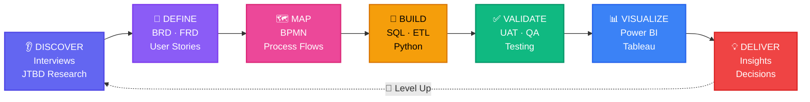

<!-- 
  ISHTARTH UMESH — OPTIMIZED PROFILE README
  File: IshtarthUmesh/IshtarthUmesh/README.md
  
  CHANGES FROM CURRENT VERSION:
  1. Removed phone number badge (privacy risk)
  2. Fixed Call badge broken URL
  3. Added GitHub Stats cards
  4. Added alt text to all images
  5. Replaced "Dropping soon" with live repo links (update once repos exist)
  6. Added "Last updated" auto-update target line
  7. Added accessibility note to ASCII tables
  8. Minor polish: added Portfolio link placeholder
  
  Keep your RPG theme — it's genuinely distinctive.
-->


[](https://git.io/typing-svg)

<p align="center">

[](https://www.linkedin.com/in/ishtarth-umesh-497582170/)
&nbsp;
[](mailto:ishtarthumesh06@gmail.com)
&nbsp;
[](https://github.com/IshtarthUmesh)
&nbsp;
[](https://www.linkedin.com/in/ishtarth-umesh-497582170/)

</p>

<br/>

---

<br/>

### 💫 *"The difference between the impossible and possible lies in determination."*

*— Adapted from my journey: Aerospace Engineer → Big 4 Business Analyst → MEM @ Tufts*

<br/>

---

<br/>

| 🌟 THE HERO'S STATS | ⚔️ ABILITY TREE UNLOCKED |
|---|---|
| <pre>Name:     Ishtarth Umesh<br>Class:    Business Analyst · Product Analyst<br>Level:    Senior (3 Years)<br>Guild:    KPMG Big 4 (Former) · Tufts (Current)<br>Location: Boston, MA 🇺🇸 · Origin: Bengaluru 🇮🇳<br><br>=== POWER LEVELS ===<br>💰 Cost Savings Identified : $1,000,000+<br>📊 Audit Accuracy         : 99%<br>📉 Error Annihilation     : 90%<br>⚡ ETL Speed Boost        : 30%<br>😊 Satisfaction Increase  : +20%<br>🎯 Leaders Empowered      : 20+</pre> | <pre>=== CORE SKILLS ===<br>▰▰▰▰▰▰▰▰▰▰ SQL            [MAX]<br>▰▰▰▰▰▰▰▰░░ Python         [LVL 8]<br>▰▰▰▰▰▰▰▰▰▰ Power BI       [MAX]<br>▰▰▰▰▰▰▰▰░░ Tableau        [LVL 8]<br>▰▰▰▰▰▰▰▰░░ Azure Cloud    [LVL 8]<br>▰▰▰▰▰▰░░░░ PySpark        [LVL 6]<br><br>=== SPECIAL MOVES ===<br>🔥 ETL Pipeline Mastery<br>🎯 Agile Sprint Leadership<br>💎 Dashboard Creation (Legendary)<br>⚡ Data Validation Automation<br>🌊 Cross-Functional Coordination</pre> |

<br/>

---

## 🏆 ACHIEVEMENTS UNLOCKED

| 🏅 | ⭐ | 💎 |
|---|---|---|
| **CLIENT SERVICE EXCELLENCE** <br/> *Reduced ETL processing by 30%* <br/> **Epic Tier Award** <br/> *KPMG Global* | **RISING STAR** <br/> *Python automation pioneer* <br/> **Legendary Tier Award** <br/> *KPMG Global* | **BIG 4 VETERAN** <br/> *3 years battle-tested* <br/> **Rare Achievement** <br/> *Fortune 500 Ready* |

<br/>

---

## ⚔️ BATTLE RECORD — KPMG SAGA

*Aug 2022 – Jul 2025 · Business Analyst · Bengaluru → Boston*

<!-- Summary for screen readers: 7 completed missions at KPMG with measurable outcomes -->

```
╔═════════════════════════════════════════════════════════════════════════╗
║                          ⚡ IMPACT DASHBOARD ⚡                         ║
╠═════════════════════════════════════════════════════════════════════════╣
║  💰  MISSION: Cost Optimization                                         ║
║      ├─ Led Agile cross-functional data pipeline design                ║
║      └─ RESULT: $1,000,000+ in savings identified            [SUCCESS] ║
║                                                                         ║
║  ✅  MISSION: Data Governance                                           ║
║      ├─ Built pipeline architecture across 5 departments               ║
║      └─ RESULT: 99% audit accuracy maintained                [SUCCESS] ║
║                                                                         ║
║  📉  MISSION: Error Elimination                                         ║
║      ├─ Deployed end-to-end validation framework                       ║
║      └─ RESULT: 90% reduction in data discrepancies          [SUCCESS] ║
║                                                                         ║
║  ⚡  MISSION: Speed Enhancement                                         ║
║      ├─ Re-architected ETL pipelines + UAT automation                  ║
║      └─ RESULT: 30% faster processing → 🏅 AWARD WON         [SUCCESS] ║
║                                                                         ║
║  😊  MISSION: Trust Building                                            ║
║      ├─ Change management + reliability programme                      ║
║      └─ RESULT: +20% stakeholder satisfaction                [SUCCESS] ║
║                                                                         ║
║  📊  MISSION: Leadership Enablement                                     ║
║      ├─ Built 5+ SQL + PySpark executive dashboards                    ║
║      └─ RESULT: 20+ leaders empowered, +8% avg efficiency   [SUCCESS] ║
║                                                                         ║
║  🕐  MISSION: Insight Acceleration                                      ║
║      ├─ Redesigned Enterprise Data Management System                   ║
║      └─ RESULT: Business insights 24 hours faster            [SUCCESS] ║
║                                                                         ║
╠═════════════════════════════════════════════════════════════════════════╣
║                    🎖️ PERFECT MISSION RECORD 🎖️                        ║
╚═════════════════════════════════════════════════════════════════════════╝
```

<br/>

---

## 📚 CURRENT QUEST — TUFTS UNIVERSITY

### *Master in Engineering Management · Sep 2025 – May 2027 · Boston, MA*

| 🎯 ACTIVE PROJECTS | 📖 SKILLS LEARNED |
|---|---|
| <pre>┌─────────────────────────────┐<br>│  📊 Retail Operations        │<br>│     Analytics                │<br>│  Status: [▰▰▰▰▰▰▰░░░] 70%   │<br>│  → github.com/IshtarthUmesh │<br>│    /retail-operations-       │<br>│     analytics                │<br>└─────────────────────────────┘<br><br>┌─────────────────────────────┐<br>│  🍱 FreshStart Food          │<br>│     Insights                 │<br>│  Status: [▰▰▰▰▰▰▰░░░] 70%   │<br>│  Boss: Customer Discovery    │<br>└─────────────────────────────┘</pre> | ✨ Technology Strategy <br/> ✨ Financial Intelligence <br/> ✨ Customer Discovery <br/> ✨ Programme Management <br/> ✨ Data Analytics <br/><br/> **🎓 Previous Training Arc** <br/> *B.E. Aerospace Engineering* <br/> *BMS College · 2018–2022* |

<br/>

---

## 🗂️ PORTFOLIO — PROOF OF POWER

*Three legendary items. Real data. Public repos.*

### 📌 [PROJECT 01 — Retail Operations Analytics](https://github.com/IshtarthUmesh/retail-operations-analytics)


> **The Mission:** End-to-end Product Analyst workflow on Olist Brazil dataset
>
> **What Makes It Special:**
> - Not just "I made a dashboard" — documents *why* each KPI was chosen
> - *What question* each SQL query answers
> - *What decision* the dashboard triggers
>
> **The Loot:**
> ```
> /problem-brief        → Stakeholder questions defined FIRST
> /sql-models           → 25+ annotated queries, one business question each
> /kpi-framework        → KPIs before dashboards (the right way)
> /powerbi-dashboard    → Packaged .pbix + screenshots
> /insight-memo.pdf     → The one-pager that gets read
> ```

### 📌 [PROJECT 02 — Data Validation Engine](https://github.com/IshtarthUmesh/data-validation-engine)


> **The Mission:** Open-source version of the tool that won me the Rising Star Award
>
> **What It Does:**
> - Point at any CSV → validates → flags anomalies → generates Excel report
> - Built for analysts, documented for non-technical stakeholders
>
> **The Loot:**
> ```
> /validator.py         → Core engine, fully commented
> /report_builder.py    → Stakeholder-ready Excel output
> /tests/               → Sample datasets included
> /README.md            → Business problem explained, not just code
> ```

### 📌 [PROJECT 03 — FreshStart Food Insights](https://github.com/IshtarthUmesh/freshstart-food-insights)


> **The Mission:** Live Tufts MEM research — identify food adaptation challenges
>
> **Current Progress:**
> ```
> /research-design      → Interview guide + survey framework
> /synthesis            → Thematic analysis, coded findings
> /insight-report       → 70%+ adaptation improvement targeted
> ```

<br/>

---

## 📊 BATTLE STATISTICS

<p align="center">
  
  
</p>

<p align="center">
  
</p>

<br/>

---

## 🛠️ WEAPON ARSENAL

*The tools I wield daily*

**⚔️ CORE WEAPONS**

[](https://github.com/IshtarthUmesh)
[](https://github.com/IshtarthUmesh)
[](https://github.com/IshtarthUmesh)
[](https://github.com/IshtarthUmesh)
[](https://github.com/IshtarthUmesh)
[](https://github.com/IshtarthUmesh)

**🛡️ DEFENSE & INFRASTRUCTURE**

[](https://github.com/IshtarthUmesh)
[](https://github.com/IshtarthUmesh)
[](https://github.com/IshtarthUmesh)
[](https://github.com/IshtarthUmesh)

**📋 TACTICAL SUPPORT**

[](https://github.com/IshtarthUmesh)
[](https://github.com/IshtarthUmesh)
[](https://github.com/IshtarthUmesh)

**🎯 COMBAT TECHNIQUES**


<br/>

---

## 🎓 TRAINING COMPLETED

| 🏫 TUFTS UNIVERSITY | 🏫 BMS COLLEGE |
|---|---|
| **Master in Engineering Management** <br/> *Sep 2025 – May 2027* <br/> *Boston, MA* <br/><br/> 📚 Technology Strategy <br/> 📚 Financial Intelligence <br/> 📚 Customer Discovery <br/> 📚 Programme Management <br/> 📚 Data Analytics | **B.E. Aerospace Engineering** <br/> *Aug 2018 – Jun 2022* <br/> *Bengaluru, India* <br/><br/> ✈️ Systems Thinking <br/> ✈️ Engineering Precision <br/> ✈️ Problem Solving Under Pressure <br/><br/> *Then I applied it all to business.* |

<br/>

---

## 🎖️ CERTIFICATIONS EARNED

[](https://github.com/IshtarthUmesh)
[](https://github.com/IshtarthUmesh)
[](https://github.com/IshtarthUmesh)
[](https://github.com/IshtarthUmesh)

<br/>

---

## 💭 WHAT MAKES ME DIFFERENT

| ❌ WHAT EVERYONE ELSE SAYS | ✅ WHAT I ACTUALLY PROVE |
|---|---|
| "I'm proficient in SQL" | SQL that found **$1M in savings** at Big 4 |
| "I have Agile experience" | **Led Agile** across 5 departments at KPMG |
| "I've built dashboards" | Dashboards **used by 20+ executives daily** |
| "I work well with stakeholders" | Drove **+20% satisfaction** score |
| "I know Python" | Python that won a **company-wide award** |
| "I'm a strategic thinker" | Aerospace → Big 4 → Tufts **(that IS strategy)** |
| "Big 4 background" | Big 4 **+ 2 awards + MEM** |

<br/>

---

## 🎯 MY BATTLE STYLE



<br/>

---

## 💬 THE FINAL BOSS QUOTE

### *"Data doesn't lie. But it doesn't tell the truth either.*
### *You have to ask it the right questions."*

**That's what I do. I ask better questions than everyone else in the room.**

<br/>

---

## 📬 READY TO TEAM UP?

### 🔥 I respond fast. Usually same day. Let's talk.

<p align="center">

[](https://www.linkedin.com/in/ishtarth-umesh-497582170/)

[](mailto:ishtarthumesh06@gmail.com)

</p>

<br/>


<!-- Last updated: March 2026 -->
