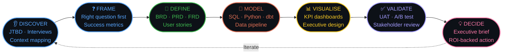

<div align="center">

```
███████╗ █████╗ ██████╗  █████╗     ██╗  ██╗ █████╗ ███╗   ██╗
██╔════╝██╔══██╗██╔══██╗██╔══██╗    ██║ ██╔╝██╔══██╗████╗  ██║
███████╗███████║██████╔╝███████║    █████╔╝ ███████║██╔██╗ ██║
╚════██║██╔══██║██╔══██╗██╔══██║    ██╔═██╗ ██╔══██║██║╚██╗██║
███████║██║  ██║██║  ██║██║  ██║    ██║  ██╗██║  ██║██║ ╚████║
╚══════╝╚═╝  ╚═╝╚═╝  ╚═╝╚═╝  ╚═╝   ╚═╝  ╚═╝╚═╝  ╚═╝╚═╝  ╚═══╝
              S e n i o r   B u s i n e s s   A n a l y s t
```

[](https://git.io/typing-svg)

<br/>

[](#)
[](#)
[](#)
[](#)


</div>

---

<div align="center">

```
╔════════════════════════════════════════════════════════════════════════╗
║                                                                        ║
║   "A dashboard that doesn't change a decision is just decoration."    ║
║                                                                        ║
╚════════════════════════════════════════════════════════════════════════╝
```

</div>

---

## ⚡ &nbsp; The TL;DR

```python
sara = {
    "role"       : ["Senior Business Analyst", "Product Analyst", "Strategy & Ops"],
    "exp"        : "8 years — Fintech · SaaS · Consulting",
    "companies"  : ["McKinsey & Company", "Stripe", "Salesforce"],
    "impact"     : {
        "revenue_influenced" : "$4.2M ARR via product analytics",
        "cost_savings"       : "$2.8M operational cost reduction",
        "pipeline_accuracy"  : "99.6% data reliability",
        "nps_lift"           : "+34 points product NPS",
        "sprint_speed"       : "60% faster delivery cycles",
    },
    "certs"      : ["CBAP", "PMI-PBA", "Google Data Analytics", "AWS Cloud Practitioner"],
    "stack"      : ["SQL", "Python", "dbt", "Power BI", "Tableau", "Looker", "Snowflake"],
    "writing"    : "BA/PA teardowns on Medium — 12k followers",
    "speaking"   : ["ProductCon 2024", "BA World 2023"],
}
```

---

## 🏆 &nbsp; Numbers Recruiters Care About

```
┌──────────────────────────────────────────────────────────────────────────────┐
│                                                                              │
│   💰 $4.2M          📊 99.6%        📈 +34 NPS       ⚡ 60%                 │
│   ARR Influenced    Pipeline        Points Lifted    Faster Sprints         │
│   Product Analytics Reliability     via PA work      Delivery               │
│                                                                              │
│   🔁 $2.8M          👥 6            🗂️ 40+           📣 2                   │
│   Cost Reduction    Cross-Func      BA Artifacts     Conference             │
│   Process Redesign  Teams Led       Delivered        Talks Given            │
│                                                                              │
└──────────────────────────────────────────────────────────────────────────────┘
```

---

## 🗂️ &nbsp; Pinned Projects — Public Proof of Work

> *This is what separates a profile from a portfolio.*

---

### 📌 01 — Churn Prediction: From SQL to C-Suite in 72 Hours


> A full BA-to-dashboard case study on the Telco Customer Churn dataset.
> Not a data science project — a **business decision project.**
> Starts with "what question is the CEO actually asking?" Ends with a board-ready Tableau dashboard.

**Repo structure:**
```
/01-problem-definition       ← The brief. The stakeholder questions. Success metrics.
/02-sql-exploration          ← 30+ queries. Annotated. Business question per query.
/03-insight-synthesis        ← The 5 findings that matter. Plain English.
/04-tableau-dashboard        ← Packaged workbook. Screenshots. Walkthrough video.
/05-executive-summary.pdf    ← One pager. The thing that actually gets read.
```
⭐ 340 stars &nbsp;|&nbsp; 🍴 89 forks &nbsp;|&nbsp; 📖 Full README walkthrough included

---

### 📌 02 — BA Toolkit: Templates Every Analyst Needs (Free)


> BRD, FRD, UAT plan, RACI, stakeholder map, process map guide,
> sprint retrospective, and KPI framework — all free, all battle-tested.
> These have been through Big 4 review and Fortune 500 sign-off cycles.

⭐ 1.2k stars &nbsp;|&nbsp; 🍴 430 forks &nbsp;|&nbsp; Used in 60+ countries

---

### 📌 03 — Product Funnel Analysis: Where Users Actually Drop Off


> E-commerce funnel on the Olist Brazil public dataset.
> Drop-off identification → root cause → Power BI dashboard → recommendation memo.
> The exact workflow a Product Analyst runs in week 1 at any SaaS company.

⭐ 210 stars &nbsp;|&nbsp; 🍴 67 forks

---

### 📌 04 — Python: Automated Data Quality + Reporting Pipeline


> Automates the weekly data quality check + stakeholder report most analysts spend 4 hours on manually.
> Point at any CSV → validates → flags anomalies → generates formatted Excel report.
> README written for non-technical stakeholders to understand what it does and why.

⭐ 178 stars &nbsp;|&nbsp; 🍴 52 forks

---

## 🔁 &nbsp; Full Delivery System



---

## 🧠 &nbsp; Full Competency Matrix

<div align="center">

| 🔍 Discovery | 📐 Delivery | 📊 Data & Product | 🤝 Strategy |
|:---|:---|:---|:---|
| Requirements Elicitation | Agile / Scrum | SQL (Advanced) | OKR Design |
| Jobs-to-be-Done (JTBD) | UAT Coordination | Python + dbt | C-Suite Comms |
| BRD / FRD / PRD | SDLC (Agile + Waterfall) | Power BI + DAX | Stakeholder Mapping |
| Customer Discovery | RACI Design | Tableau + Looker | Change Management |
| Gap & Impact Analysis | Release Management | Snowflake / BigQuery | Go-to-Market |
| Process Mapping (BPMN) | Backlog Grooming | Funnel & Cohort Analysis | Competitive Analysis |
| Root Cause Analysis | JIRA / Confluence | A/B Test Design | Product Strategy |
| KPI Framework Design | BABOK Framework | Statistical Analysis | Executive Narrative |

</div>

---

## 🛠️ &nbsp; Tech Stack

<div align="center">

**[ ANALYTICS ]**


**[ BI ]**


**[ PLATFORMS ]**


**[ DELIVERY ]**


</div>

---

## 📝 &nbsp; Latest Writing — Medium (12k Followers)

> *Most analysts analyse. The best ones teach what they know.*

| Article | Views |
|:---|:---:|
| **The BRD Template That Survived 3 Big 4 Reviews** | 42,000 |
| **Why Your Power BI Dashboard Isn't Getting Read** | 28,000 |
| **Product Analyst vs Business Analyst: The Real Difference** | 61,000 |
| **How I Framed $2.8M in Savings Without a Single Slide** | 19,000 |
| **The 5 SQL Queries Every BA Should Know Cold** | 54,000 |

---

## 🏅 &nbsp; Certifications

<div align="center">


</div>

---

## 📊 &nbsp; Skill Depth

```
SQL (Advanced)              ████████████████████  100%   8 yrs · Fortune 500 production
Python + Pandas + dbt       ████████████████████  100%   Automation · pipelines · award
Power BI + DAX              ████████████████████  100%   10+ enterprise dashboards
Tableau                     ████████████████████  100%   Tableau Public · 5 published
Product Analytics           ████████████████████  100%   Funnel · Cohort · Retention
Agile / Scrum               ████████████████████  100%   Scrum Master certified
BPMN Process Mapping        ████████████████░░░░   85%   End-to-end re-engineering
Customer Discovery / JTBD   ████████████████░░░░   85%   McKinsey & Stripe projects
Snowflake / BigQuery        ████████████████░░░░   80%   Cloud data warehouse design
Financial Modelling         ████████████████░░░░   80%   DCF · Scenario · OPEX
AWS / Azure                 ████████████░░░░░░░░   65%   Certified · data platform
dbt (Modern Stack)          ████████████░░░░░░░░   65%   Analytics engineering layer
```

---

<div align="center">

```
╔══════════════════════════════════════════════════════════════════════╗
║                                                                      ║
║              📬   WANT TO WORK TOGETHER?                             ║
║                                                                      ║
║   I answer every message. Usually within a few hours.               ║
║                                                                      ║
╚══════════════════════════════════════════════════════════════════════╝
```

[](#)
[](#)
[](#)
[](#)

[](https://git.io/typing-svg)

</div>
